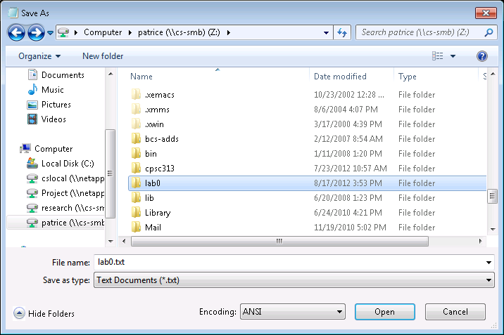
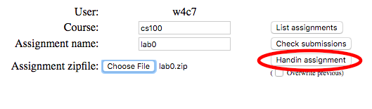

Welcome to CPSC 100!
=========================================

Learning Goals
---------------
  * Learning how to make a post on Piazza
  * Familiarizing yourself with CS Web Handin 

Before the Lab
-----------
Always read the lab instructions before each lab session. Fully understand the lab etiquette described below.

For additional background, you may wish to skim Chapters 2 and 3 of the textbook prior to the lab.

Lab Etiquette
-----------
Things you should do:
  * Feel free to ask the Teaching Assistants (TA) any relevant questions.
  * Log out and let someone else use your computer if you must leave for longer than 15 minutes.
  * Feel free to interact with your fellow students and, in turn, be helpful if called for. However, in the end, you must do your own thinking and your own work.

You will not hurt or damage the equipment through normal use.

Things you shouldn't do:
  * Smoking, food and beverages are not permitted in the lab.
  * Don't touch the screen with pens, pencils, fingers or other objects.
  * Do not power the machines off (and, especially, do not use the power switch at the back of the machine). Simply logout from your current session.
  * Do not play games in the lab.
  * Do not play, display or print any material that could be objectionable to fellow users. You are responsible for the sounds played, the pictures displayed and the pages printed on your computer or from your account.
  * Do not give your password to anyone. You are responsible for your account and its use.
  * Penalties will be administered for failure to comply with the lab rules. Penalties for academic misconduct may result in denial of lab access and subsequent failure in the course.

Getting Comfortable
-----------
Long sessions with the computer can cause you physical discomfort or even harm if you're not careful. Learn how to take care of yourself by reading up on how to get comfortable while using the computer (also known as ergonomics).

----
During the Lab
-----------
Look for **deliverables in bold** which you need to show your TAs for marks.

Icebreaker!
-----------
Classes/labs are definitely more fun when you get to know your classmates! Your TAs will start a short icebreaker activity to get everyone quickly acquainted. Form groups of 3-5 people and wait for your TA's instructions.

Start the Computer
-----------
You can choose to use your own computer or use the lab computers.

**If you are using the lab computers:**  

When you come to the lab, the computer will most likely already be on. If for some reason it is not, you may need to switch it on; however, you should first make sure that the monitor is on. Whether or not the computer was on initially, however, you must first log in (remember that each lab computer is shared by all account holders). If you already have an account, enter your username and password in the login dialog box. Keep your password a secret!
TIP: Stuck in the Unix/Solaris Login Screen (green screen) when you want Windows? Press 'Control + Moon' on your keyboard. From here you can choose to work in Windows.
If you do not yet have an account, the following section will show you how to set one up.

Create an Account (CS and Piazza)
-----------
1. *Obtain a CS student account.* You may have already done this in order to log in to the computer. If not, open and follow the instructions at https://www.cs.ubc.ca/getacct.
2. *IMPORTANT: Write down your login ID!* You will need it each time you log in during the lab. 
3. *The login ID assigned to you forms your UBC computer science email address.* It is *\*\*\*\*\*@ugrad.cs.ubc.ca, where your CS login ID replaces \*\*\*\*\**. 
4. For example, if your login ID is "a1a1", then your new email address is a1a1@ugrad.cs.ubc.ca. 
5. Remember this ID, and keep your password safe! You will need both of these every time you log in.
6. *Register with Piazza* using the code given by your TAs. Piazza is a course bulletin board service that we will be using this term — most online discussion for the course will occur here. *The account for Piazza is different from the CS student account you just created.* You will need to create a separate account for Piazza:
  * Go to CPSC 101 on Piazza.
    * Click the Sign Up button.
    * When prompted for a school name, enter "University of British Columbia" into the text book (note that this is different from entering "The University of British Columbia"). You will see three options displayed underneath where you have just entered text-- please choose the option that says "University of British Columbia (ubc.ca, cs.ubc.ca)".
    * You will be then guided to a screen that asks for what course you want to enroll in. Enter "cpsc 101" into the textbox and select the option that appears underneath the textbox.
    * There will be a radio button that appears underneath the textbox once you select "CPSC 101: Connecting with Computer Science" as your course. This radio button simply means you will be enrolling in this class as a student. Click on the radio button (the circle next to the word Student).
    * On the right side of "CPSC 101: Connecting with Computer Science", you will notice a box has appeared that asks you for a Class Access Code. Ask your TA for the class access code.
    * Once you have entered in the class access code, click on the Join button on the bottom of the page.
    * Submit your email, then check that e-mail account and enter the validation code
    * Pick any e-mail address that you want to receive e-mail at, and enter your full name — please use the name that you registered with along with any nickname that you'd like
  * If you do have an account, log on, and follow the instructions using any of the info that you have above.
7. *Set up and test email forwarding.* When you signed up for your CS account, you may have done this already. It is important that you do this so that your TAs can contact you throughout the course of the term. If you did not do this, go here and click the link under "Email Forwarding".
8. Using your personal email, send an email to your CS department account (eg. c3p0@ugrad.cs.ubc.ca). Verify that this email arrives at your personal email. Note: If your personal email is a gmail account, this will not work: have someone else send an email to your CS department account in this case.
9.Each lab is taught by two teaching assistants (TAs). Find your TAs' emails on the [Contacts](http://www.ct.cs.ubc.ca/contacts.html) page.
10. **Deliverable**: Forward the email you sent to your ugrad.cs.ubc.ca account to your TAs containing the following things:
  * A keyword that can be found on Piazza (hint: look for the first post under the Lab 0 - Getting Started tag)
  * Your name
  * Your lab section
  * Use "CPSC 101 Lab 0" as your subject header.
11. If you could not get your CS department email to properly forward to your personal email, contact them from your personal email. Mention that you could not get your CS account to work, and contact the help desk to assist you with any problems you are encountering.

Create a Text File
-----------
A file is a collection of bytes stored as an individual entity. All data on disk is stored as a file with an assigned file name that is unique within the folder (directory) it resides in. Different types of files are used for different purposes. A text file is a file that contains only characters meant for displaying and formatting text.

**Deliverable**: Type the following information about yourself into the document:
  * Name
  * Hobbies & Interests
  * Intended major

You can choose to use your own computer or use the lab computers. If you are using a Mac, you can create a text file using TextEdit.

**If you are using the lab computers:**  
1. Use Notepad++ to create a text file.  Open Notepad++ by clicking on Start --> All Programs --> Notepad++ --> Notepad++.
2. Once you type in the information, click *File* from the menu bar, choose *Save* or *Save as*,
Next choose disk/drive Z in the left half of the *Save in* box, click on the button labeled *New Folder*, type in *lab0* and then press enter. The window should now look as follows:

3. Double-click on the folder called "lab0" and type lab0.txt as your File name. Then click Save.
4. Close the file by choosing File -> Exit, if it asks "Do you want to save changes?" Click Yes.
5. Find the "Home Directory" icon on the desktop. Double click on it, find Disk Z, double click on it, and then make sure there is a folder "lab0" that has a file lab0.txt in it (this file may simply show up as "lab0", with type "Text Document"). If not, you need to create the file again.  *IMPORTANT*: Please note Disk Z represents the storage space you are allocated with the creation of your computer science account. Aside from what you place in this space, administrative files will also exist (which you should not remove/alter).
 
Web Handin
-----------
You will use the CS department's web handin tool to hand in your text file. To do so, you will need your CS ID from the "Create an Account (CS and Piazza)" section. 

1. Zip the text file that you created in the previous section.
  * If you are using the lab computers, navigate to the lab0 folder that you created in the previous section. Right click the folder and 
  * On a Mac
    * Create a new folder by clicking Shift + Command + N simutaneously.
    * Drag your text file into the folder.
    * Right click the folder and click "Compress"
2. Go to the [web handin tool](https://my.cs.ubc.ca/docs/hand-in) and log in with your CWL (not your CS ID).
3. Click on “Run Hand-In”.
4. Log in with your CS ID.  
Course : cs100  
Assignment: lab0
5. Click the “Choose File” button next to “Assignment Zipfile” and in the window that follows, navigate to where your zipfile is, and click “Ok”. 
6. Click “Hand-In Assignment” .

