Lab: Welcome to Visual Programming
==================================
Let's open up SNAP at [http://snap.berkeley.edu/run](http://snap.berkeley.edu/run)

You will see a screen like the one shown below. Explore the aspects of the user interface. Play around for a while and see if you can figure out the major components of the interface. In the next step, you will make your first project and explore further.

Let’s first look at the IDE (Integrated Development Environment).

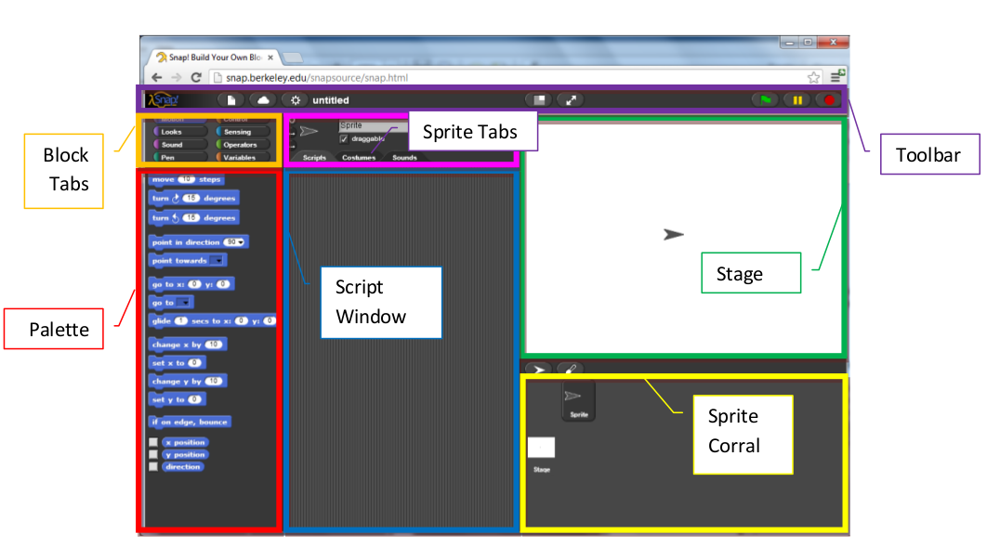

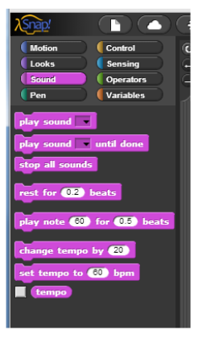

Make a sprite sing
------------------
For your first project, make a quick song! You will find the following **blocks** in the Sound tab useful; feel free to change the default numbers as you see fit.

While you are working on it, try to figure out how to connect and disconnect blocks, and how to remove a piece from inside a long script. Also, what do you think is the difference between these two blocks?

*Hint*: Try to use many copies of one of the blocks in a row, and hear the result. Do this for each block.

Meowing: One at a Time or in Unison?
------------------------------------
With this brief introduction to the scratch interface, we begin to examine how sprites and blocks
interact and affect one another. For example, the "play sound" blocks from earlier allow us to control
when and how many sounds we here. Consider the difference between these two blocks?

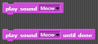

If you set up a small script like this, how many meows do you you hear?

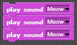

How about one like this: How many meows do you hear now?

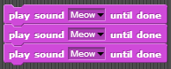

Experiment with these blocks: 1) How about two "play sound (meow)" and then one "play sound (meow) until done"?

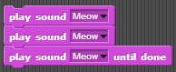

2) How about two "play sound (meow) until done" and then one "play sound (meow)"

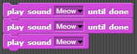

Explain the difference between 1) and 2). Why did you hear a different amount of meows?

Some Starting Lingo
-------------------

| Term | Example/Description |
| ---- | ------------------- |
| Tabs (for blocks) | 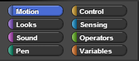 |
| Tabs (for sprite) |  |
| Blocks | 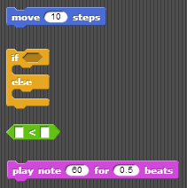 |
| Script | 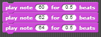 |
| Sprite | 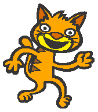 |
| Costumes (Each sprite can have multiple costumes) | 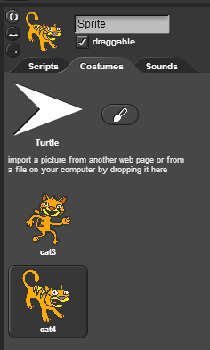 |
| Stage | 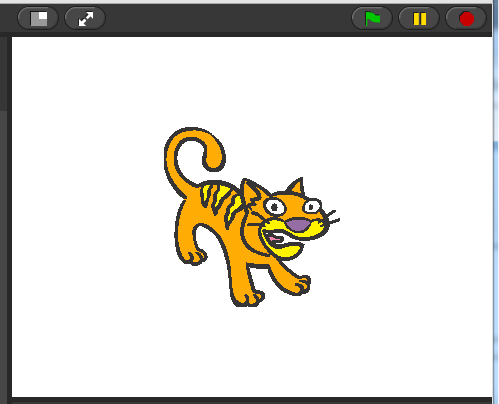 |
| Bug  | A defect (or a problem) in the code or routine of a program. |
| User Interface | The place where interaction between humans and machines occurs. For exam, Windows, Scratch, the iPod touch screen, and even your keyboard are examples of user interaces. |

Experiment with a Short Play
----------------------------
Try to make these scripts in SNAP! You will find that the Cat and the Duck have completely separate
script areas. Click on each character to see their script area. Once you are done, press the green flag to
start the short play.

Cat’s Script Window

Duck’s Script Window
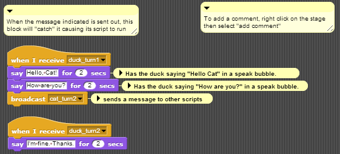

A note about style
------------------
You will notice that we chose to name the messages that were broadcast so that it would help us keep
track of what we were doing and what messages we were sending. We recommend that you do this in
your projects!

Hints
-----
To choose a new sprite, drag an image file into the Costume area. Click on the paint brush to create a new image of your own.

Try to figure out what the commands (whose images are on the left) and buttons (whose images are on the right) do. These will be helpful to get the characters to face each other.

Try It! Play
------------
Once you have this working, change the sprites, and then change the script of the "play" so that each
character says at least two additional lines.

Exporting Sprites
-----------------
By this point, you have probably figured out how to save your projects, but you can also save individual
Sprites separately. To save (or export) a Sprite, right-click on the sprite and select export this sprite. To
load (or import) a Sprite, click on the icon with a folder next to New Sprite (circled in yellow in the image
below) and select the Sprite that you want to add to your project.

