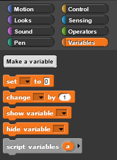
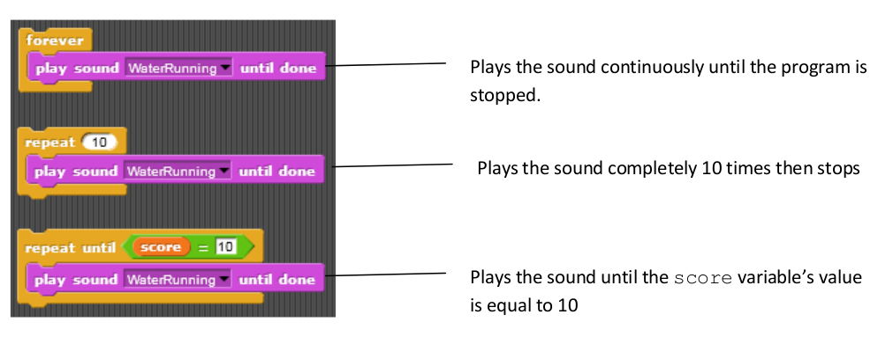
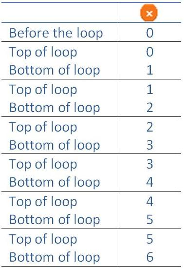

Lab: Variables and looping
==========================
Let's open up SNAP at [http://snap.berkeley.edu/run](http://snap.berkeley.edu/run)


Variables
---------
Variables are named spaces in memory that your program can access. You can set
and modify the values that are contained in these named spaces. To visualize a
variable’s name space think of mail slots in a large mail room. Your computer has
memory that the program is going to use to create and store information. When you
create a variable, you are assigning one of the "slots" of memory to a name and
then can put a value in that slot and modify it as needed.


Why create variables? Variables allow the programmer to make the value modifiable
in the script. For example, you want to be able to update a score variable as the
player wins/loses in a game. You will see many different uses of variables during
this course.

You have multiple blocks to create and manipulate variables in the Variables tab palette.



 * ```Make a variable``` button allows you to create a new variable
 * ```Delete a variable``` button will allow you to delete a button – this
   button only shows after you have created a variable.
 * ```Set [] to (0)``` will allow you to initialize, or set a beginning value,
   the variable to a value.
 * ```Change [] by (1)``` allows you to modify the value of a variable
 * ```Show variable []``` will show the variable and value on the stage.
 * ```hide variable []``` will hide the variable and value on the stage.
 * ```Script variables (a)``` will allow you to create local variables, more on
   this use later

### To create a variable

 * In the box that pops up - type the name of the variable. The default selection
   "for all sprites" means that all sprites have access to this variable. Select
   "for this sprite only" if you want only the sprite currently selected to be
   able to access/modify the value of the variable.


 * Now you'll have blocks to use for your variable.
 * Note that you now have a rounded button with the name of the variable in the
   window with a checkbox to the left. If checked, the variable and value will
   be show on the stage. Uncheck to hide.
 * When you use one of the variable blocks you will be able to click on the combo
   box arrow for a list of your variables.


### Common Bug: Set vs. Change

A very common mistake is to use a change block when you need a set block or use
a set block when you need a change block.

It is actually a little more complicated, in that you can make your set block act
like a change block.


Looping Blocks
--------------
There are times when you will want blocks to repeat. Instead of duplicating blocks
and ending up with a long script that might be confusing, there are looping control
blocks that you can wrap around the script you want to repeat.

 * ```forever``` Loops until the program ends. This is basically an *infinite loop*
   as it goes on forever.
 * ```repeat ()``` Loops the specified number of times.
 * ```repeat until &lt; &gt;``` Repeat until the condition is *True*.
 
For the ```repeat until &lt; &gt;``` you will use a predicate block that returns
true or false. These blocks have pointed ends and can be found in the Operators
palette.


Other helpful blocks include the operator blocks.


Operators
---------
Click the Operators tab to display a new palette of blocks. You can use
these blocks to perform mathematic operations to modify a numeric variable.

You have blocks to add, subtract, multiple and divide. You also have a
mod block that does remainder division as well as a round block and a
square root block.

NOTE: To see what any block does, right click on a block in the palette
and select help. A new window will open that will explain what that block does.


Looping Examples
----------------


### Repeat Until
Let’s look at the "repeat until" block a bit closer. Just like REPEAT, it will do everything inside the C-
shaped block a certain number of times. However before it starts the loop each time, it checks to see if
the condition (x > 5) is true. When this is condition is true, it will not repeat again.


It can be really helpful to keep track of what the variable X is at each point to help us understand how
this new piece works.

 * In the right column we keep track of the value of x.
 * In the diagram below we draw a horizontal line every time we start the loop.
   Here we labeled each line "Top of loop" and "Bottom of loop" but we could just
   use the horizontal line to keep track of this information.
 * Within each loop the variable x increases by 1, so we write down the new value for x.



Try to use a chart like the one above to keep track of what happens in the complicated "repeat until"
code below.


Drawing Tools
-------------
There are multiple blocks that can be used to draw. By combining blocks from the Pen palette with
blocks from the Motion palette, you can draw pictures. Your sprite needs to face in the direction you
want the line to be drawn so you will need the point in direction () block.


Try it! Drawing shapes
----------------------
Look at the following scripts to draw a square. The first script has repetitive
code. In the second script, the repeating code has been replaced by using a loop.

Note: By using the ```pen down``` block your sprite will draw for you.


Exercise: Draw a Squaril
------------------------
Make a new variable Length with a looping structure to draw the "Squiral" (Square + Spiral) below. Note
that the length the sprite moves is updating by a constant amount.


