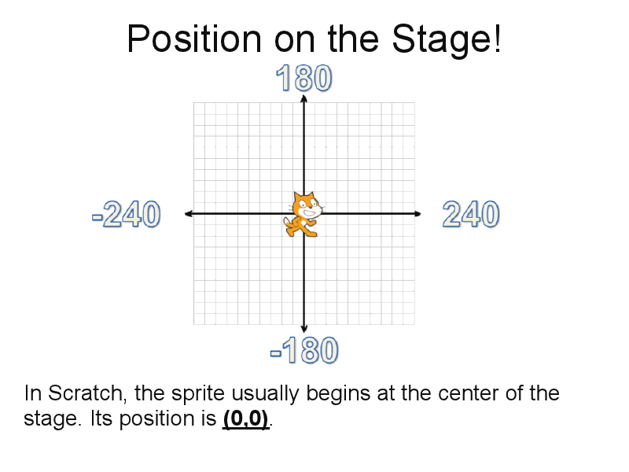

Exercise: Position on the stage
===============================
The sprite occupies a point(x,y) on the stage corresponding to the x- and y-
axis. Here's a picture:

The next lesson asks you to move a random character around the stage within
certain boundaries. Keep in mind the coordinate system shown above. 

