Lab: Build Your Own Blocks
==========================
Let's open up SNAP at [http://snap.berkeley.edu/run](http://snap.berkeley.edu/run)

As you have seen, SNAP/BYOB is a powerful language that has a substantial
repository of useful blocks for a variety of purposes. However, as you may have
noticed, SNAP/BYOB does not have all the blocks that you may need, and often, it
would prove useful if we could create new blocks.


Make Your Own Block: A Tutorial
-------------------------------
We are going to teach the computer how to draw a square using a block named
```draw square```. Please follow the steps below:

 * Click on make a block at the bottom of the variables tab.
 
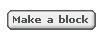

 * This will open up the ```make a block``` dialog box. Now, you get to choose
   which tab the block should go into. Our block is going to draw a square, so
   let us choose ```Motion```.
 
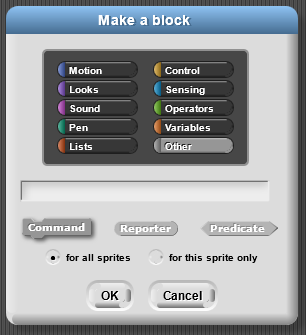

 * When we selected ```Motion```, the block became blue. We now have the option of
   making blocks of different shapes. Right now, however, we are just going to
   make a (regular) command block.

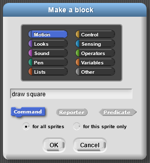

 * When we click ```OK```, we should see the block editor below.


 * Use the blocks from the regular menus to create a script that draws a square,
   as shown below.

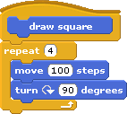

 * When you click ```OK```, you should be able to use this block as if it were a
   regular block. Since you created the block as a ```Motion``` block, it will
   end up at the bottom of the ```Motion``` tab.

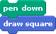

Congratulations! You have just created your own block!


Improving the draw square block
-------------------------------
You have created a block that draws a square, but it only draws a square where
each side is of length ```100``` steps. It would be great if we could specify
how long we wanted each side to be. We will edit the block to accept an *argument*
(or *input*), which tells it the length of the square it has to draw.

 * We are going to go back and edit the block. Right-click on the new block and
   select edit to go back to the block editor.

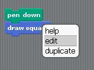

 * In the ```Block Editor```, notice that when you move the mouse over the top
   row of the new block, some plus signs (+) show up. When you click on these
   plus signs, you can add more text or arguments. When you click on the text
   between the plus signs, you can delete or modify that text. Click on the plus
   sign at the far right as shown below:

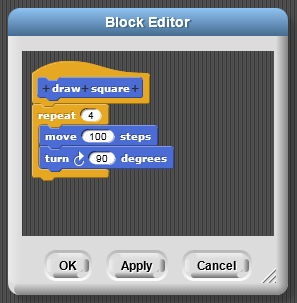

 * When you click on the plus sign on the far right, you should get the following
   dialog box. With this dialog box, we can select if we want to add input (orange)
   or more text (blue). We want to add the input ```size```, so we type ```size```,
   select ```Input Name``` and click ```OK```.

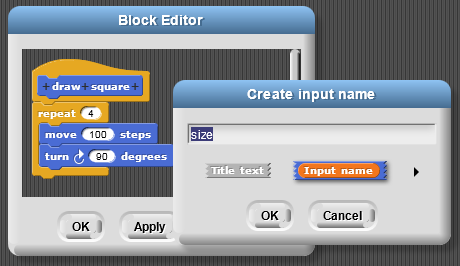

 * Now, we have a variable inside our block definition.

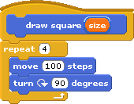

 * Drag the variable ```size``` down into the move block. Whenever we need a
   new copy of a variable, we just grab the copy from that variable in the top row.

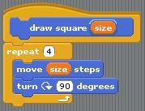

 * When we click OK, we wll see that our draw square block now takes an argument.
   We can put different numbers in the blank and draw squares of different sizes!

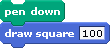


Make a draw shape Block
-----------------------
Now, you are going to make a block that takes two inputs. We want to create a
```draw shape``` block that takes a number of sides and a number of pixels for
the length of each side. We will call these input arguments ```n``` and
```pixel```. This exercise should be done with a partner, so introduce yourself
to your neighbor and get started on the exercise together!

By the way, you can create the inputs to this block in exactly the same way as
we did in the previous section, by clicking on the plus signs to add input;
however, you can also type the names of the input as shown below.

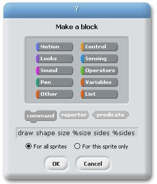

The percent signs (%) indicate that the word should be an input. We want you to
feel comfortable with both entry methods.


The Max block
-------------
We will now make a different kind of block -- a *reporter* block. To demonstrate
this, we will make a block called ```max``` that takes two numbers as input and
reports the bigger value (the maximum).

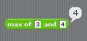

 * Click ```Make a block``` and select the ```Operators``` tab. We want a
   reporter block. This will give the block its round shape as shown above. As
   the name implies, reporter blocks can report a value. In the image below, you
   can see that we used the % shortcut for making input variables.

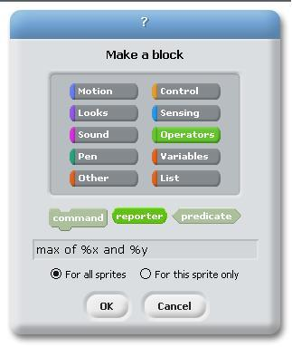

 * This should give you a blank Block editor. We need to figure out what should
   be reported. To keep track of the value to be reported, we are going to make
   another variable. There are two ways to do this: Use a ```Script Variable```
   block. You can click on the name of the variable and change it to bigger value.
   Alternatively, you can just report which of the two is larger.

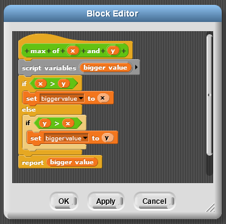

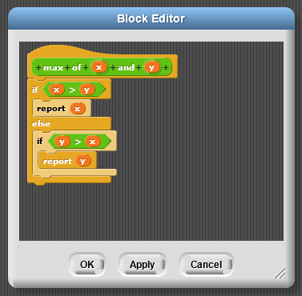


Input Types
-----------
Unfortunately, we have a bug with our ```max``` block! We wanted the ```max```
block to work only for numbers. Yet, you can type text in!


We are going to limit the ```max``` block to accept only numbers as arguments.

 * Open the Block Editor for the ```max``` block and click on the input ```x```

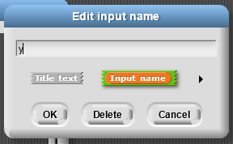

 * Then, click on the right arrow in the pop-up box shown above. This will open
   the dialog box shown below. This allows us to specify the shape of the slot.
   We want a numbers-only slot (as shown selected below). We can also specify
   that we want the variable to have a *default* value; this is similar to
   blocks like move that always start out with the default value 10.

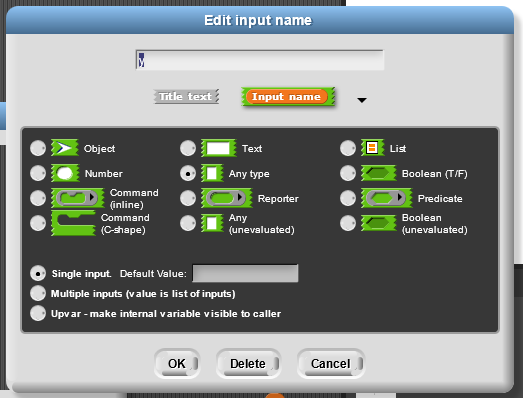


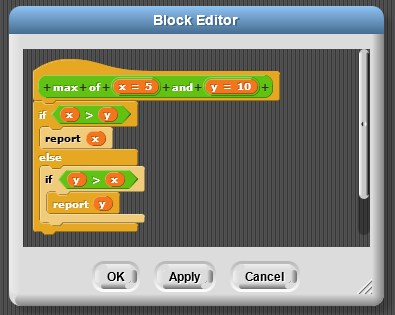

 * When you click OK, you should be able to see your block in the Operators tab,
   with the default values filled in. Also, note that you will no longer be able
   to enter text.

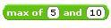

Note: Maybe we *did* want the ```max``` block to work with words! However, for
the ```draw square``` and ```draw shape``` blocks, we definitely only wanted
numbers. Modify those blocks to only take in numbers.


Composition of Functions
------------------------
Our custom-made blocks are blocks like any other, and we can use them in other
block definitions. To demonstrate this, we are going to make a block that
computes the maximum of three values

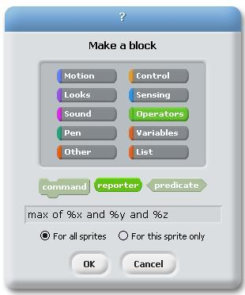

Repeat the steps from the last tutorial to make this version of the ```max```
block also only take numbers. Then, in the script for the block, we can use two
copies of our ```max``` block.

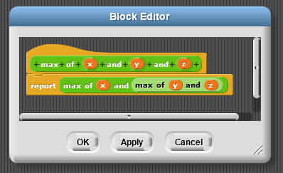


Try It! AddNumbers and JoinText
-----------------------------
Your challenge is to create the following two blocks. You can use the same project file.

 * A three-argument addition operator that only accepts numbers.


 * A three-argument ```join``` operator that has the default values shown below
   and only accepts text.


Predicates
----------
We want to make our own predicate, a kind of block that reports either ```true```
or ```false```. We have a "greater than" operator (), an "equal" operator (=),
and a "less than" operator (&lt;), but we want a new "greater than or equal to" (=)
operator.

 * We will create the new block and select the ```predicate``` shape.

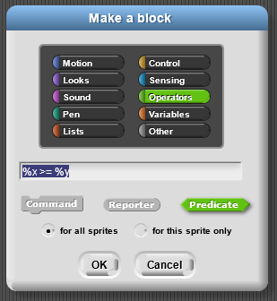

 * This gives a ```Block Editor``` that has a predicate-shaped blank at the bottom.
   There, we need to place the predicate that we want to report.

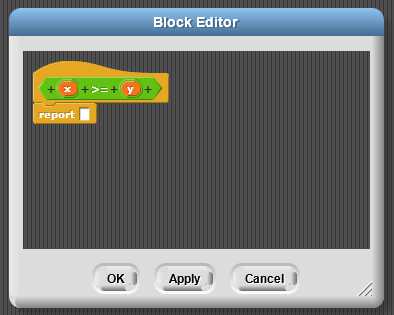

 * We can fill that in with a composition of a "greater than", "or", and "equal"
   operators. Make this with your partner and then try it out. Notice that this
   predicate block reports either ```true``` or ```false```.

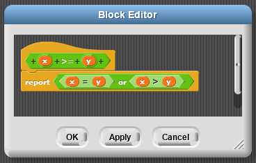


Try It! Predicates: Make a between block
----------------------------------------
Create a new predicate block that determines if a number is between two other
numbers. The block should return ```true``` if the first number is between the
two numbers or if it is equal to either of the numbers.


Different Kinds of Variables
----------------------------
We've seen a lot of different types of variables.

 * **Normal/Global variables**: These variables are made in the regular menu and
   can be used ANYWHERE! The variable "score" below is an example. *These can be
   used by any sprite, in any block or in any script*.

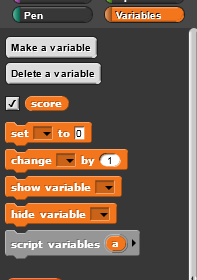

 * **Sprite Specific Variables**: When you create a "normal/global" variable you
   can select that the variable is "For this sprite only". Then these variables
   will show up as variables listed below the line in the variables tab. *We
   recommend not using these variables in blocks.*

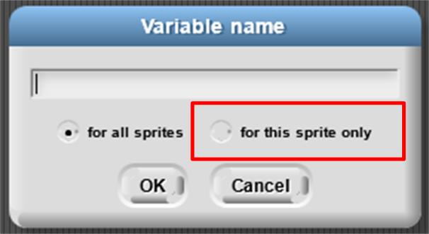

 * **Arguments to a function**: A variable set by the person calling the
   function. We also refer to this as "input". *This can ONLY be used within the
   block editor.*


 * **Script Variables**: The "script variable" block gives us a variable that we
   can use inside of this script. *These can only be used in that particular
   script. The script could be a block script (shown below) or a regular script.*


Try It!: Simplifying a tic-tac-toe board drawer using functions
---------------------------------------------------------------
In the previous lab, we used a ```repeat``` block to avoid duplicating code. Similarly,
we can use a function to avoid duplicating code. Below is some code to draw a
tic-tac-toe board. Your goal is to create functions that make this code simpler.
One important thing to keep in mind is to give your new functions really intuitive
names, so that it is easy to read the code and understand what it does.

Using the blocks below, create two new function blocks, draw line and next line,
to draw the tic-tac-toe board. You will still have some of the code from the
original script. You can create additional blocks for those functions.

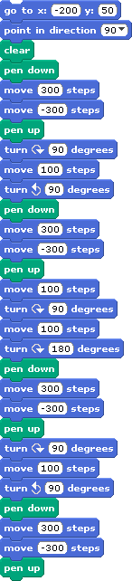


