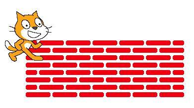
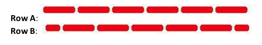
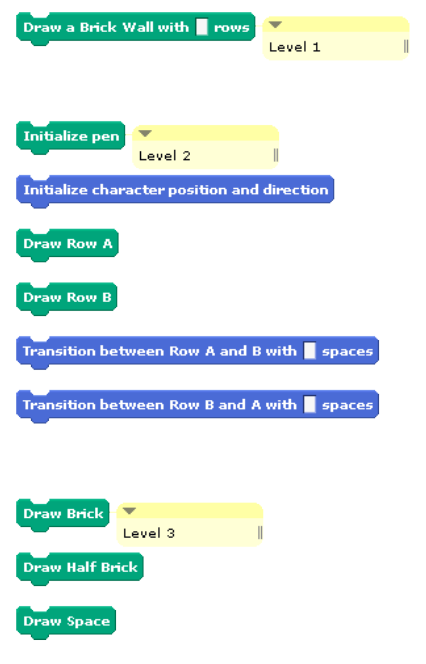

Project: Brick Wall
===================
Let's open up SNAP at [http://snap.berkeley.edu/run](http://snap.berkeley.edu/run)


Sometimes, when we write programs and scripts, it feels like we have hit a brick
wall! (This is a good sign - it is supposed to be hard!) We are going to draw
this brick wall.



This project is not just about drawing; it is also about practicing abstraction.
You will draw the following brick wall by implementing the blocks listed below.


*Note: You must implement these blocks and adhere to the abstraction described below.*

There are two kinds of rows in this brick wall:



The big idea is that there are three levels of abstraction. Start creating your
new blocks at Level 3, then create for Level 2 (using your new blocks from Level
1), and then create Level 1 using your Level 2 blocks.

*Note: a “brick” is just a thick line.*


### At the lowest level of abstraction (Level 3):

 * You need to figure out how to draw individual bricks, small bricks and spaces.
   The bricks are simply thick lines.
 * This level of abstraction contains the following blocks:
 * The ```Draw Brick``` block, which draws a single brick.
 * The ```Draw Small Brick``` block, which draws the small brick for the edges
   of row B. Note that this brick will not be exactly half as long as the full
   brick. Part of this assignment is figuring out how long the "small brick"
   should be.
 * The ```Draw Space``` block, which draws a space between each brick or small brick.


### At the middle level of abstraction (Level 2):

 * You can use the functionality provided by the bottom level of abstraction to
   make entire rows of bricks.
 * The rows referred to as "Row A" and "Row B" should look like the rows shown above.
 * This level of abstraction contains the following blocks:
 * The ```Initialize Pen``` block, which should initialize the pen color and size.
 * The ```Initialize Character Position``` and ```Direction``` block, which should
   initialize the position and direction of the character.
 * The ```Draw Row A``` block, which should draw a single copy of Row A.
 * The ```Draw Row B``` block, which should draw a single copy of Row B.
 * The ```Transition between Row A and B with __ space``` block, which should
   transition between the end of Row A and the beginning of Row B, leaving a
   space as wide as the number of pixels specified by the input argument.
 * The ```Transition between Row B and A with __ space``` block, which should
   transition between the end of Row B and the beginning of Row A, leaving a
   space as wide as the number of pixels specified by the input argument.

HINT: You will need to determine if there is an even number of rows or an odd
number of rows to be drawn as well as if the row being drawn is an even number
or odd number one. You can use the ```() mod ()``` block to help.

Example: if TotalNumberOfRows mod 2 = 0 then the total number of rows is even
(any even number divided by 2 leaves a remainder of 0). You can use the same
logic to determine if the row to be drawn is even or odd (if RowNumber mod 2 = 0).


### At the highest level of abstraction (level 1)

 * You will put together the full brick wall using only the functionality
   provided by the middle level of abstraction.
 * This level of abstraction contains only the ```Draw a Brick Wall with __ rows```
   block, which draws a brick wall with the specified number of rows.

Note: Whenever you need to refer to a number in the program, use a variable. This
is generally considered good style, because you can use the same variable in
multiple places in your program, and you only need to change the value of the
variable to change it in multiple places at once.


In summary, you should implement the following blocks:



