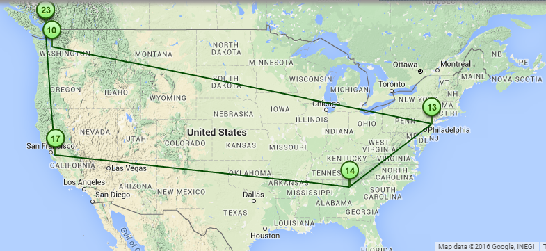

Fun with the Internet
=========================================

Learning Goals:
---------------
  * Use visual tools to better understand what happens under the hood when we load a webpage
  * Be able to show on a map (at a high level) how a packet is routed and forwarded
  * Examine a visual representation of all the assets that a webpage requests/loads
  * Compare packet speed (light speed) to page loading speed (seconds) and be able to explain the descrepency

The Big Question this lab asks/answers:
---------------------------------------
If packets of information move at the speed of light what are some reasons that web pages can take a measurable amount of time to load?

Visualizing Internet Routes
---------------------------
Find a partner to work on the lab together!

Point your browser to this [Internet route visualizing tool](http://www.monitis.com/traceroute/).

This will show you the route from a computer (by default near Seattle, WA, USA). If you want to start from locations in Europe and Asia/Pacific, you can use the tabs to change the computer you start from. 

Below we have a list of interesting servers from all over the world. Pick one (or use your own choice) by copying and pasting it into the input field at the top of the page. Now, click "Start Test". Make sure to try at least three servers, each from a different country.

* ct.cs.ubc.ca (Vancouver, Canada)
* www.mars.dti.ne.jp (Japan, Tokyo)
* mpi-sb.mpg.de (Germany)
* www.univ-paris1.fr (France)
* lanczos.maths.tcd.ie (Ireland)
* ida.liu.se (Sweden)
* alunos.ufv.br (Brazil)
* www.unb.br (Brazil)
* www.unsw.edu.au (Australia)
* mail.iis.sinica.edu.tw (Taiwan)
* rrzmta2.rz.uni-regensburg.de (Germany)

The green line you see is the route your packet takes to get to the server that you entered!

Let's take a look at some of the data about its trip. Scroll down until you see a list of hops along with some times in milliseconds (ms).
If traceroute can't find any data, it will display a * or n/a for that hop. Also, if it does not have an estimate for the packet's round trip, it will display a * or 0 ms for the time.

For each hop that we have data for, we are shown three times: each time is the delay (in ms) that a packet takes to that router and back (known as RTT). A time of 0ms or * means traceroute didn't have a estimate for that hop.

Notice that the RTT numbers are not the same. Can you imagine why the time for a packet to get there and back would vary?

Answer:

>! One reason could be that the network maybe more or less congested, much like a traffic jam.

Show your TA:

1. The server that is the furthest away in distance
2. The serverthat is the most hops away (can you get one longer than 20 hops?)
3. Be able to explain why the times there and back can vary.

Page Load Analysis
------------------

Go to [Page Load Analyzer](http://www.monitis.com/pageload/).

Now that we understand what's involved with sending data to and from a server, let's take a look at what a page loads when we visit it.

Try looking at your favorite website. In our example, we will look at a simple site such as ct.cs.ubc.ca. 

Take a look at the Domain column (3rd from the left) - that is where we are requesting our data from.
This means that the data or packets will need to travel from that server to us along a route, which you have seen before.
On the right hand side, you can see how long it took for that request to be fullfilled.

Try looking at a few sites with your partner and then show your TA the following:

1. A website that loaded the most amount of different domains (can you get more than 5?)
2. A website that had the fastest total loadtime (can you get faster than 200ms?)
3. An explanation of what factors make a website slow to load

You're Done!
------------------
That's it for the lab! Make sure your TAs have marked your work before you go.
