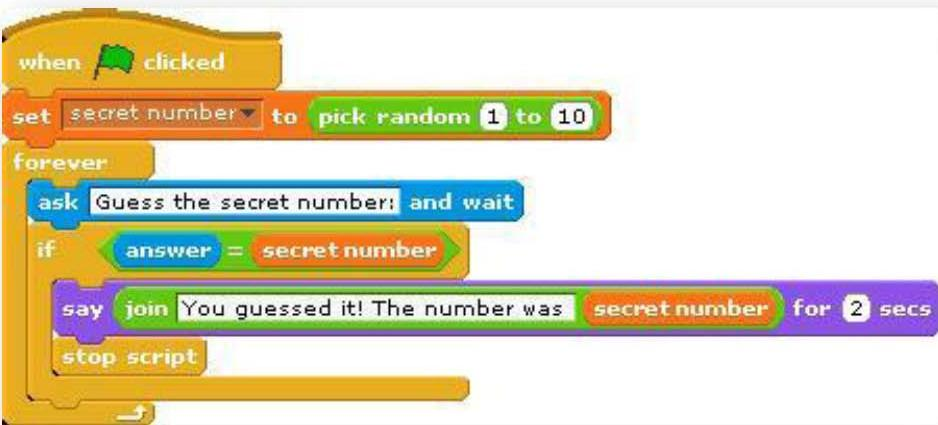
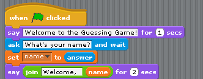

Lab: Random Numbers and Conditionals
====================================
In this lab you will create a guessing game. Look at the script below. The
computer chooses a random number and then asks the player to guess the random number.

### Algorithm
    When flag clicked
      Set the secret number 1 to 10
      Repeat forever
        Ask for guess and wait
        If the answer = the secret number
          Say Guessed It Message
          Stop the loop

### Script

Step 0
------
Before beginning to build your program, let’s look at what variables we will
need to begin the game.

 * The secret number
 * The guess from the player

Next, we need to figure out the tasks that the sprite and player will be
enacting.

 * The Sprite will begin by setting up the game's variables and chosing the secret
   number.
 * The Sprite will ask for a guess from the player.
 * The player will input their guess.
 * If the player's guess was correct, the sprite will give the player a message
   and the game will end.

Note that there is a new block above that will return a random number between the two input
numbers (inclusive). This block is in the Operator’s palette. You can enter a number or use a
variable. Because this is a reporter block you can use it inside other blocks as an input.

The game is not that cool yet, though. In the next few steps, we are going to make the game much
more like playing the number-guessing game with a person! Here are tasks to try to make the code
act more like a human! If you think of anything else that would make it cooler, feel free to add it in.
Try each of these in order. When you are done, your finished code should be able to deal with all of
the tasks.

Step 1
------
Add to your beginning script the blocks so that the sprite welcomes the player and asks for
their name before beginning.

Step 2
------
We want to give the player more information if they don’t guess correctly. Have the sprite tell the
player if the secret number is bigger or smaller than the number that they guessed.

Step 3
------
Right now, the sprite always picks a number between 1 and 10. Change this so that the sprite
always picks a number between 1 and a variable named max. (Don’t forget to add the variable.)
Add to your script so that it asks the player what they would like the maximum number to be,
before choosing a random number. Use this maximum number as the highest number that the
sprite will choose.

Step 4
------
Now let’s keep track of how many guesses it takes before the player guesses the right number. You
will need a new variable for this task and will need to add to it every time a guess occurs.

Step 5
------
When the player guesses the secret number, tell them how many guesses it took, and congratulate
them using their name.

