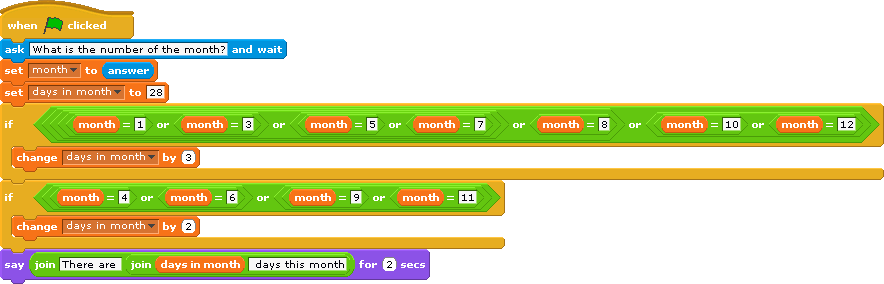

How many days are there in a given month?
=========================================
We have created a [Scratch file](../code/DaysInMonth.sb) that calculates the number of days in a month based on a month number(eg. 1-12) that a user types in. Discuss with your partner how this Scratch file works. There are a lot of new things in this program that you may not have seen before, so be sure to play around with them.

Note: This code is not written with the best style. We hope your reaction to this is YUCK! We have made the code explicitly complex to help you review some of the blocks from the first lab. In future lab sessions, we will learn to write this type of script more elegantly.

