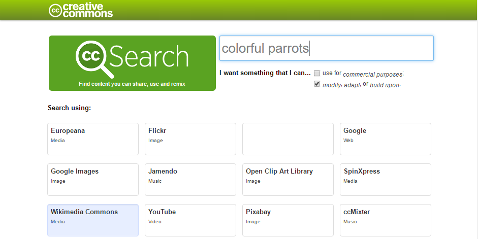

yout: page
title: Imaging Lab
unit: 5
uniturl: 05-image
lab: 0
laburl: 00-prelab
---

Image Processing Pre-Lab
====================

In our image processing lab we will be working w/ some colorful images and manipulating them by destarating part of image. That means we will select a prat of the image to keep all it's colour while removing colour from the rest of it. 

For your pre lab, find an image you think would be fun to play with!

Part 1: Find a colourful image to manipulate
--------------------------------------------

Let's start by finding an image that you want to desaturate, we suggest something colourful.

Try using this [search tool](https://search.creativecommons.org/) to find creative commons images

This tool let's you search google, wikipedia or other sources for creative commons licensed images.

If you want to learn more about cc you can read about it [here](https://creativecommons.org/about/)

When yuo have selected an image you will need to have the URL handy!

Here's an example of what we will do to a image:

 

