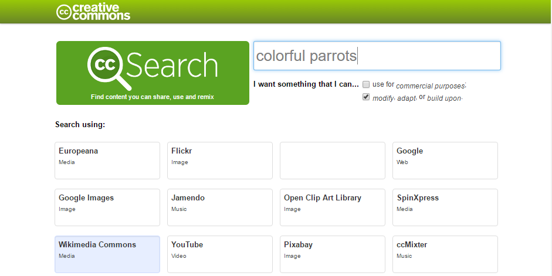
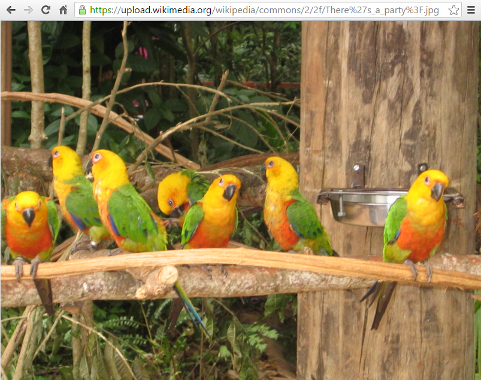
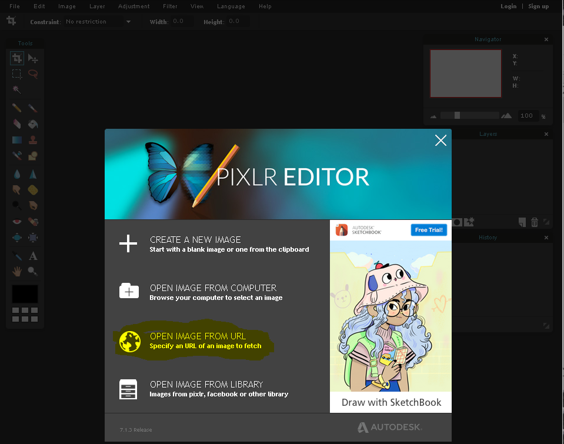
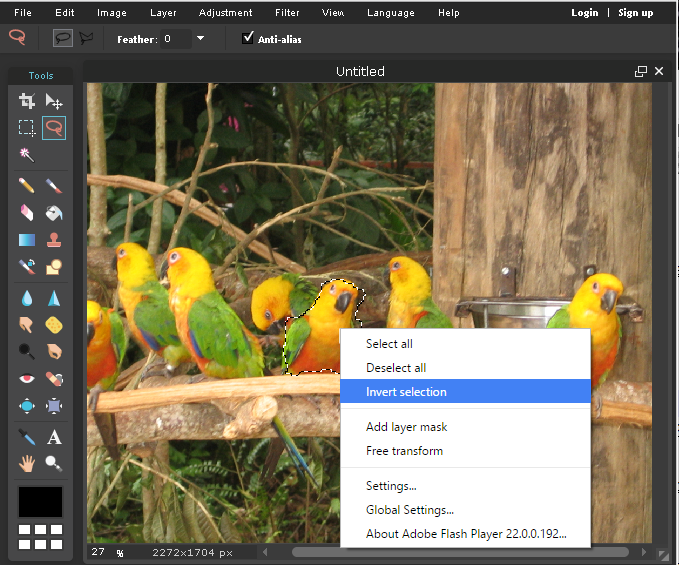
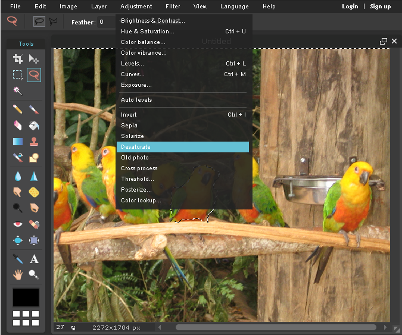
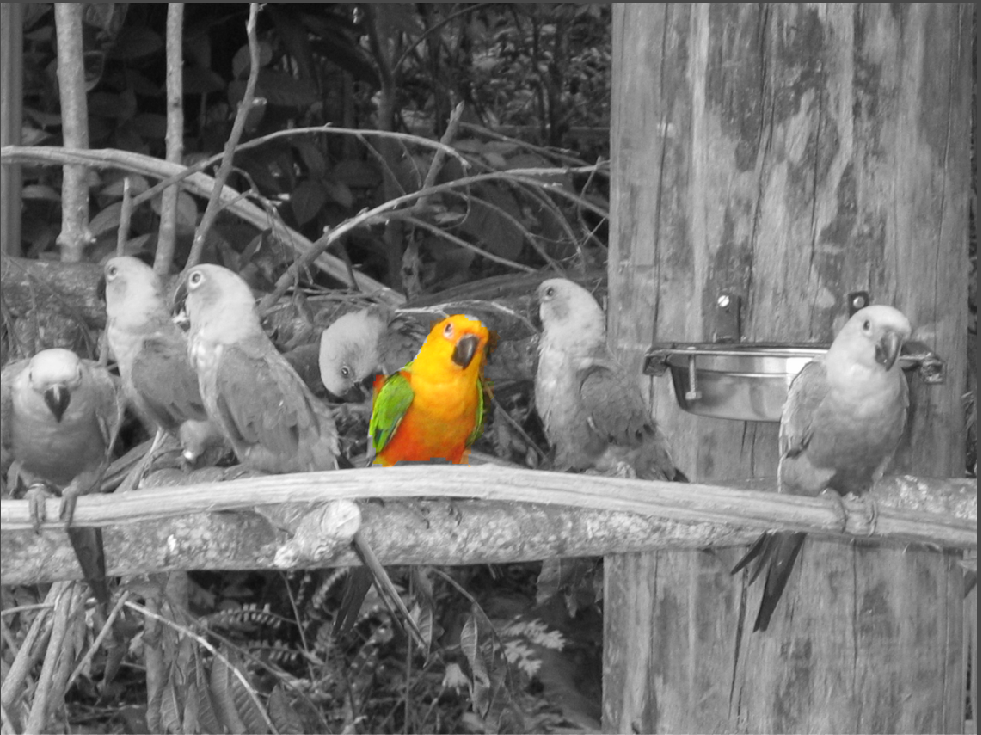
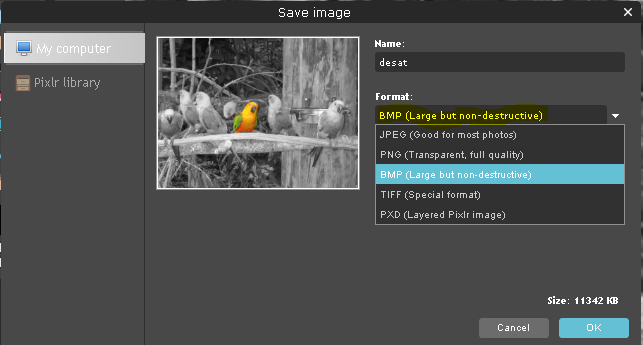
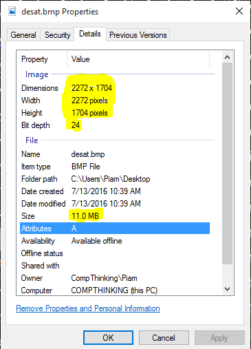

yout: page
title: Imaging Lab
unit: 5
uniturl: 05-image
lab: 1
laburl: 01-image
---

Image Processing Lab
====================

Tools
-----
Online image editor of choice: https://pixlr.com/editor/ **Requires Flash**

Find CC images: https://search.creativecommons.org/

Learning Goals:
---------------
+ Be able to explain at a high level how a filter works 

+ Be able to explain loss of information in terms of filters

Part 1: Desaturate an image
---------------------------

Let's start by finding an image that you want to desaturate, we suggest something colourful.

Try using this [search tool](https://search.creativecommons.org/) to find creative commons images

Once you have your image of choice copy the url into your clipboard.

Now point your browser to [pixlr](https://pixlr.com/editor/) the image editing tool we are going to use.

Click the Load image from url option that pops up or goto File -> Open image Url and copy/paste your url

While we can easily apply a filter to the entire image, let's instead use the lasso to pick a part of the image to desaturate for contrast.

Select the lasso tool from the left bar, and trace around one object in your image that you *don't* want to apply the filter too.

Now right click inside the selection and select the image and invert the lasso 

You should now have a selection of your entire imag except what you first outlined. 

You can now adjust or filter the rest of the image and see how it looks. Let's try Desaturate (though you are welcome to try your own filters/adjustments).

From the Adjustment menu, select Desaturate.

You should now have an image that has for the most part lost all of it's color, expect where you left it!

 

Now save your image as a BMP, by going to File -> Save.. and selcting the format BMP.

Questions:
----------
If you where given this image, do you think you can go back to the original fully coloured image?

Part 2: Image Size
------------------

Let's take a look at the properities of your BMP image and try to understand what the approximate size of our image is.

Right click on your image and select view details. Let's take note of the number of pixels (width/height) and the Bit Depth, and see if we can work out the size of the file.

Activity: Estimate file size from it's pixels
---------------------------------------------

	1. How many pixels wide/high is your image

	2. How many pixels total are you seeing in just that image. (Hint: Width * Hieght)

	3. How many Bytes is each pixel?

	4. What should the Approximate total size of the image be?

In our example our image is 2272 pixels wide and 1704 pixels high.

That means there are 2272 * 1704 = 3,871,488  pixels in our image.

Now lets consider how many bits it take to represent a pixel!

We see in our image details that our Bit depth is 24, this means that each pixel is represented by 24 bits.

We know that every 8 bits is 1 Byte, so each pixel is 3 Bytes. 

Now let's calculate how many Bytes our image should be and see if it matches!

3,871,488 pixels * 3 Bytes/Pixel = 11,614,464 Bytes, or 11.6 Million Bytes which is approx 11 MegaBytes. There are some extra bytes being used to identify the type of file and we are usually shown a approx size)	
Where you able to approximate the size of your image based on it's pixels and pixel depth?

Optional Section:
=================

Is it possible to represent an image exactly with fewer bytes? Is this true of all images? lossless encoding... where doesn't this work (101 lab does this).

