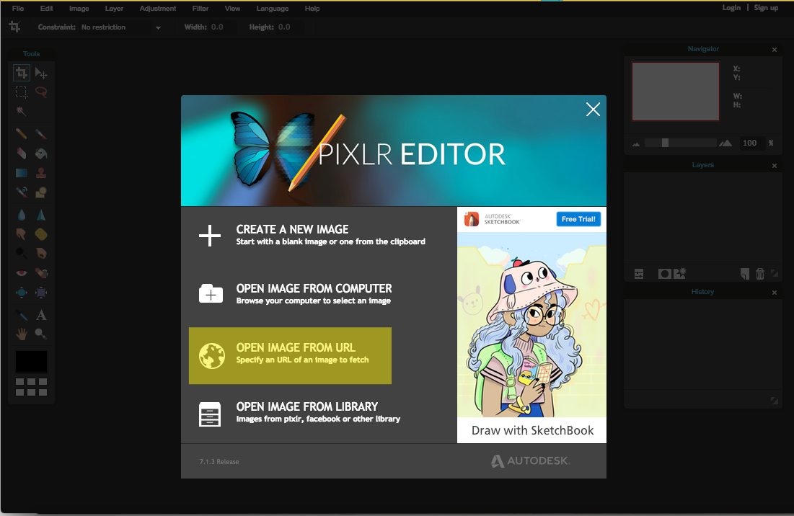
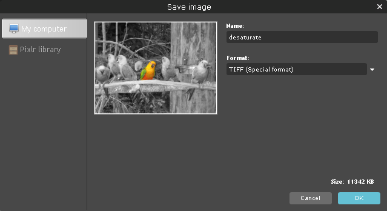
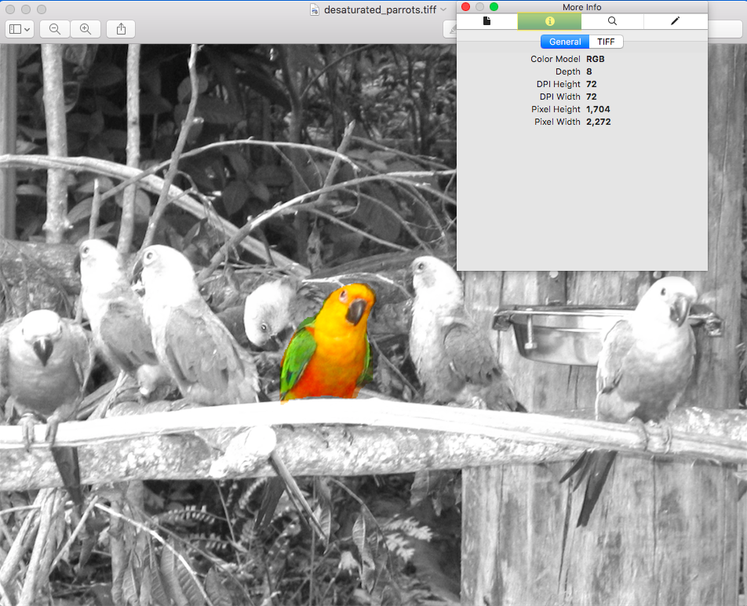
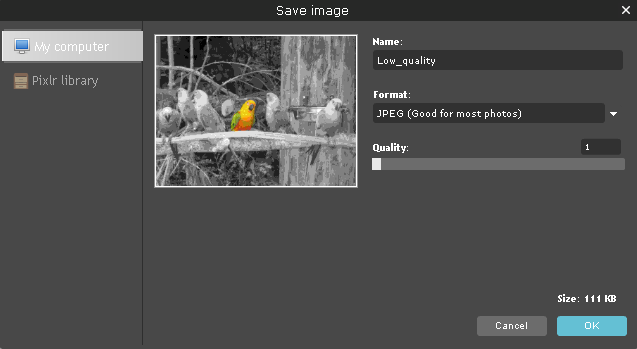

Image Processing Lab
====================

Tools
-----
 * Online image editor of choice: https://pixlr.com/editor/ **Requires Flash**
 * Find CC images: https://search.creativecommons.org/

Learning Goals:
---------------
 * Explain, at a high level, how a filter works 
 * Explain loss of information in terms of filters

Part 1: Desaturate an image
---------------------------

During the Prelab, you found an image you wanted to work with. If not, use this [image](https://upload.wikimedia.org/wikipedia/commons/2/2f/There%27s_a_party%3F.jpg). Copy the URL of the image you will be using by right clicking the picture and selecting "Copy Image Address".

Now, point your browser to [Pixlr](https://pixlr.com/editor/), the image editing tool we are going to use.

Click the "Open Image From URL" option in the box that appears when you first load the page or go to "File" -> "Open image URL". Paste your image's URL into the text box.

While we can easily apply a filter to the entire image, let's try only desaturating a part of the image for contrast.

Select the lasso tool from the left bar, and trace around one object in your image that you *don't* want to apply the filter too.

Now, right click inside the selection and select "Invert Selection". 

You should now have a selection of your entire imag except what you first outlined. 

You can now adjust or filter the rest of the image and see how it looks. Let's try Desaturate (though you are welcome to try your own filters/adjustments).

From the Adjustment menu, select Desaturate.

You should now have an image that has, for the most part, lost all of its color, expect where the area you used the lasso tool to select!

 

Save your file by going to "File" -> "Save" and selcting the format TIFF.

Question:
----------
If you were given this image, do you think you can go back to the original fully coloured image?

Part 2: Image Size
------------------

Let's take a look at the properities of your TIFF image and try to understand what the approximate size of our image is.

**For Windows/lab machines:**
Right click on your image and select "View Details". 

**For Macs:**
Open up your image using the Preview app. Go to "Tools" -> "Show Inspector" (or press command + i) and click on the second tab in the window that appears.

Let's take note of the number of pixels (width/height) and the bit depth, and see if we can work out the size of the file.

Activity: Estimate file size from its pixels
---------------------------------------------

	1. How many pixels wide/high is your image

	2. How many pixels total are you seeing in just that image. (Hint: Width * Hieght)

	3. How many Bytes is each pixel?

	4. What should the Approximate total size of the image be?

In our example, our image is 2272 pixels wide and 1704 pixels high. That means there are 2272 * 1704 = 3,871,488  pixels in our image.

Now, let's consider how many bits it take to represent a pixel!

From our image details, we see that our bit depth is 24. This means that each pixel is represented by 24 bits. If you have a Mac, you will notice that the details window says "Depth 8". It means that 8 bits is used to represent each of the RGB channels in the picture (i.e., 8 bits are used to represent red, 8 bits for green, and 8 bits for blue). The total bit depth per pixel is still 24. 

We know that every 8 bits is 1 Byte, so each pixel is 1 Byte. 

Let's calculate how many Bytes our image should be to see if it matches!

3,871,488 pixels * 3 Bytes/Pixel = 11,614,464 Bytes, or 11.6 Million Bytes which is approx 11 MegaBytes. There are some extra bytes being used to identify the type of file and we are usually shown a approx size).

Were you able to approximate the size of your image based on its pixels and pixel depth?

Part 3: Compression
===================

Lossy
-----

Open your desaturated image in [Pixlr](https://pixlr.com/editor/) (or your favorite image editing software) and save it as another file format (e.g., jpg).

To start, we will save it as a JPG with high compression. JPG's use a form of compression that is considered lossy meaning data is thrown away. Let's see if we can spot the missing data!

Go to "File" -> "Save" and select JPG from the format. You should see a "quality" bar. This decides how much information to keep. It should be set to 80% by default but let's set it to 1% and save it locally.

**Note we can't view this file in Pixlr correctly, it needs to be viewed locally.**

Open the file locally double clicking your saved picture or by using any photo-viewing software that is not Pixlr.

Do you notice any loss of visual information?

How about the file size? How many times smaller is it than your original uncompressed TIFF file?

Of course, you can use lossy compression in such a way that the loss in image quality isn't that obvious to the human eye. These [images](https://en.wikipedia.org/wiki/File:Quality_comparison_jpg_vs_saveforweb.jpg) are a great example!

Lossless
--------

Another form of compression is called lossless. You will see a lossless compression algorithim in class.

Here, we will simply compare two files, a TIFF that uses no compression and a PNG that uses lossless compression.

Open your TIFF image again, and save it as a .png file.

It's hard to see but the image quality is exactly the same. Take a look at the file size: which is smaller the TIFF or the PNG?

Question: Is it possible to have a compression algorithm that doesn't lose any information?
