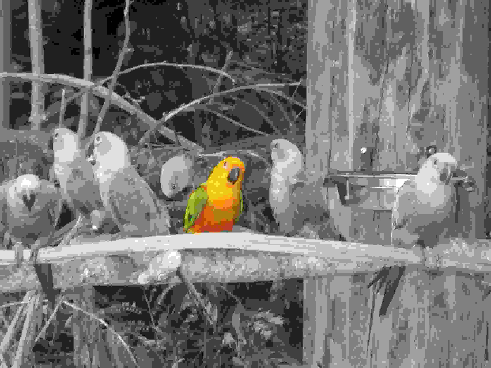

Image Processing Lab
====================

**Notes**

Remove BMP format since it's a propietary MS format.
refer to this [document](http://users.wfu.edu/matthews/misc/graphics/formats/formats.html) to pick the correct format and remember to cite it.

Tools
-----
Online image editor of choice: https://pixlr.com/editor/ **Requires Flash**

Find CC images: https://search.creativecommons.org/

Learning Goals:
---------------
+ Be able to explain at a high level how a filter works 

+ Be able to explain loss of information in terms of filters

Part 1: Desaturate an image
---------------------------

During the Prelab, you found an image you wanted to work with, if not just use this [image](https://upload.wikimedia.org/wikipedia/commons/2/2f/There%27s_a_party%3F.jpg).

Now point your browser to [pixlr](https://pixlr.com/editor/) the image editing tool we are going to use.

Click the Load image from url option that pops up or goto File -> Open image Url and copy/paste your url

While we can easily apply a filter to the entire image, let's instead use the lasso to pick a part of the image to desaturate for contrast.

Select the lasso tool from the left bar, and trace around one object in your image that you *don't* want to apply the filter too.

Now right click inside the selection and select the image and invert the lasso 

You should now have a selection of your entire imag except what you first outlined. 

You can now adjust or filter the rest of the image and see how it looks. Let's try Desaturate (though you are welcome to try your own filters/adjustments).

From the Adjustment menu, select Desaturate.

You should now have an image that has for the most part lost all of it's color, expect where you left it!

 

Now save your image as a PNG, by going to File -> Save.. and selcting the format BMP.

Question:
----------
If you where given this image, do you think you can go back to the original fully coloured image?

Part 2: Image Size
------------------

Let's take a look at the properities of your BMP image and try to understand what the approximate size of our image is.

Right click on your image and select view details. Let's take note of the number of pixels (width/height) and the Bit Depth, and see if we can work out the size of the file.

Activity: Estimate file size from its pixels
---------------------------------------------

	1. How many pixels wide/high is your image

	2. How many pixels total are you seeing in just that image. (Hint: Width * Hieght)

	3. How many Bytes is each pixel?

	4. What should the Approximate total size of the image be?

In our example our image is 2272 pixels wide and 1704 pixels high.

That means there are 2272 * 1704 = 3,871,488  pixels in our image.

Now lets consider how many bits it take to represent a pixel!

We see in our image details that our Bit depth is 24, this means that each pixel is represented by 24 bits.

We know that every 8 bits is 1 Byte, so each pixel is 3 Bytes. 

Now let's calculate how many Bytes our image should be and see if it matches!

3,871,488 pixels * 3 Bytes/Pixel = 11,614,464 Bytes, or 11.6 Million Bytes which is approx 11 MegaBytes. There are some extra bytes being used to identify the type of file and we are usually shown a approx size)	
Where you able to approximate the size of your image based on it's pixels and pixel depth?

Part 3: Compression
===================

Lossy
-----

In [pixlr]() or your favorite image editing software open your desaturated image and lets save it as another file format.

To start we will save it as a JPG with high compression. JPG's use a form of compression that is considered Lossy, meaning data is thrown away. Let's see if we can spot the missing Data!

Go to File -> Save.. and select JPG from the format. You should see a "quality" bar, this decides how much information to keep. It should be set to 80% by default let's set it to 1% and save it locally.

**Note we can't view this file in pixlr correctly, it needs to be viewed locally**

Now lets open the file locally on your computer and take a look at it! 

Do you notice any loss of visual information?

How about the file size how much smaller is it?

Of course you can use lossy compression in such a way that the loss in image quality isn't that obvious to the human eye, such as these [images](https://en.wikipedia.org/wiki/File:Quality_comparison_jpg_vs_saveforweb.jpg)

Lossless
--------

Another form of compression is called lossless, you will see a lossless compression algorithim in class.

here we will simply compare two files, one a Tiff that uses no compression and one a png, that uses lossles compression.

old version
-----------

lossy
-----

Look at these [images](https://en.wikipedia.org/wiki/File:Quality_comparison_jpg_vs_saveforweb.jpg), and see if you can detect the difference!

First visual, then image size as done in Part 2

What do you see?

(blocky, blurry, and fairly close jpg links)

What size are the images?

(more blocky, more blurry == smaller)

Notice anything about bit depth?

(32>16>8)

[either show same pixels then less bit depth or same bit depth less pixels] **I prefer less bit depth**

OR

Save your original image as a low quality jpg, and notice the visual artifacts. Welcome to lossy compression.

Now save your file (which was a TIFF) as a PNG, notice the difference is size (possibly run a diff, but most onlie diff tools I used crash at files sizes over a meg). The PNG is smaller but visually identical point out that the visuals look the same..) <-How do we prove this?

Lossless
--------

Take a look at this image that is saved as a TIFF vs PNG

We will talk about a lossless compression technique in class, and here we are going to use one!

Trying saying your image as a png and compare it to the ....

Find onine diff tool, and saves back and forth bmp -> jpg -> bmp make sure there is a high level

Exam Question: Is it possible to have a compression algorithm that doesn't lose any information?

***Credit to: 
://docs.google.com/file/d/0B3EdcN2RueUhbVd5WXY2c2ZnY2c/edits it possible to represent an image exactly with fewer bytes? Is this true of all images? lossless encoding... where doesn't this work (101 lab does this).
