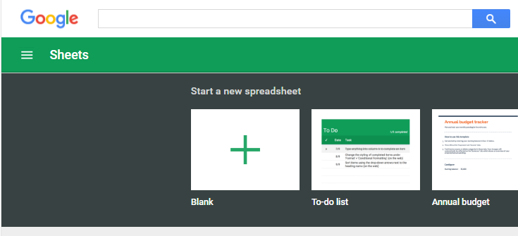
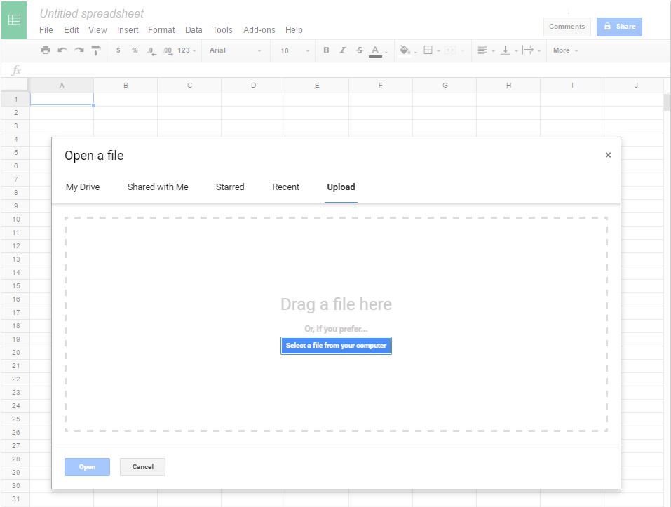
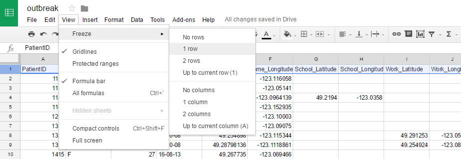
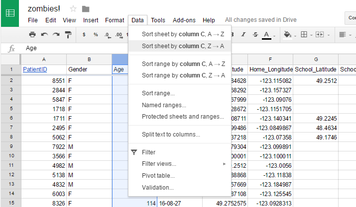
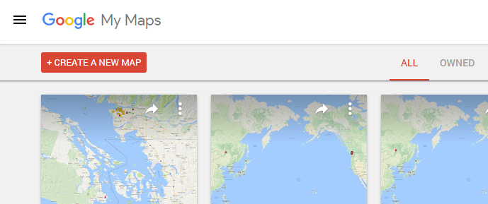
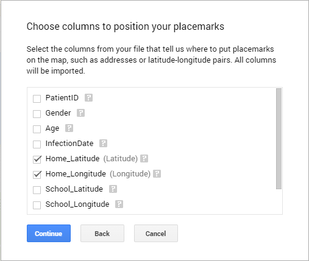
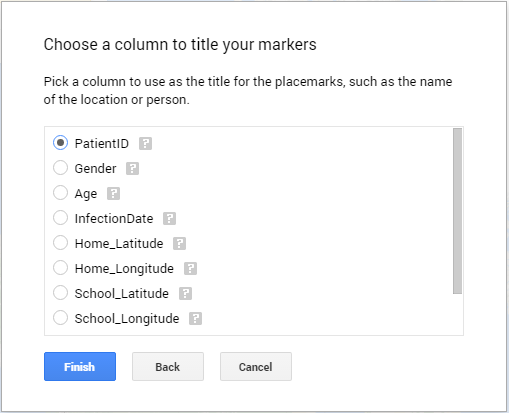
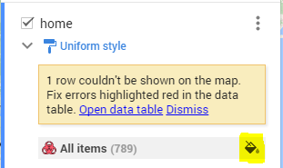
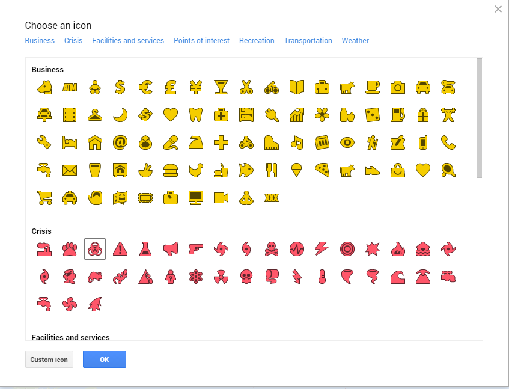
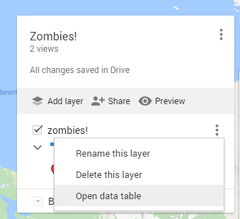

Learning Goals
--------------

* Practical skills

+ Learn how to write filters in spreadsheets
+ Clean data before analyzing it
+ Get experience with visualizing data using spreadsheets and maps
+ Creating/refining heuristics for working with data

* Soft skills

+ Familiarity with working with large data sets
+ Realizing how much can be tracked through social media/phone/VISA records
+ Understanding that data is not perfect
+ Cleaning data has consequences

Software Needed
---------------

Google spreadsheet (or any spreadsheet application that allows saving in CSV format)
Google maps (requires a Google account)
At least one Gmail account per pair

The Big Question
----------------

* What are some ways that your digital footprint can be traced? 
* How can we handle such large amounts of data to find meaningful patterns?

Lab Breakdown (2 week lab)
--------------------------

A mysterious virus has recently started spreading across the Lower Mainland. Infected individuals are becoming lethargic and sleepy with a big craving for braaaaains! The mechanism of virus transfer has not been determined but is suspected to be through sneezing or biting. Latency of the virus seems to vary across individuals. Virulence has been determined to be high and no transmission host has been identified yet.

Infections are increasing exponentially with each passing day and the Centre for Disease Control (CDC) is desperately trying to control this massive outbreak. The CDC has given you a list of individuals who have been hospitalized with this mysterious virus. You are the research scientists assigned to this case and your mission is to figure out who the very first infected patient is and determine how the virus was spread into the community.

Working with the Outbreak data
--------------------------

* Download the hospitalizations data [here](zombieOutbreakWeek1.csv)**Link Needs to be updated**. It is a csv file that Excel or Google Spreadsheets will easily recognize.

* Go to [Google SpreadSheets](https://docs.google.com/spreadsheets/). For remainder of the lab, you will need to have access to a Google account (remember, you can always make a Google account with false information!).

* From [Google SpreadSheets](https://docs.google.com/spreadsheets/) click on the box with a + labelled Blank under "Start a new spreadsheet."

* In your new spreadsheet, click on File -> Open -> Upload to upload the hospitalization data.

* To help us explore our data, we want to freeze the first row of our column headers se we scroll through the rest of the data. **Select the first row** and **Click on View -> Freeze -> 1 Row** to Freeze it.

Let’s explore our data.
-----------------------

* Let's start by getting to know our data; read all the coloumn names and get a sense of what our data is about. After reading the column names can describe the data you are lookig at?

!Answer: This is a list of PatientID's w/ Age, Gender information, followed by their date of hospitilization and the latitude and logitude of their School, Work and Home (if they have one).

Clean the data.
---------------

* Before we plot this data on a map and try to make sense of it we first have to clean the data. Do all the data values make sense? Are they withing bounds that you would expect?

Answer: There are a few people who where much older than a 100, this maybe an error.

* If we had the time/resrouces we could flag all the rows we find suspicious and compare them to other data sources to see if we can find/fix the error. However in our case we suggest you simple remove any rows that have obvious errors.

* Is it possible to manually go through each and every entry to check for irregularities?
 
!Answer: Maybe but it would take a little bit of time and we could make mistakes and miss things

* What if our data set was twice as big? 

!Answer: Less likely

* What if our data set was 4 times or 8 times larger?

!Answer: At this rate we will quickly scale outside our ability to read all the values in a lifetime

* We are going to try use a simple method to quickly clean the data, there are multiple ways of doing this we will use the simplest of sorting the data and looking at the highest/lowest values to take out outliers that seem implausable.

* Click on any cell in Age column of the spreadsheet. Click on Data-> Sort Sheet by Column C, Z-->A. **Do not Sort range, as that will only sort your column and not all the rows associated with that age**

* The very oldest patients are now at the top of our spreadsheet. Delete any rows with ages that don’t make sense by shift clicking all the row numbers you dont want and selecting "Delete rows x-y" where x-y is your selectd range.
Hint: You may have found around a dozen people whose ages where suspicious and could be removed.

* Let's try the same thing with the "Infection Date". Sort Sheet by Column D, Z-->A and A-->Z. Do you see anything interesting?

!Answer: We have some dates from 2013/2014 which is well before the infection break out, those rows can be removed.

**Note: I can't find this bad data, did we add it? remember our data is year-month-day**

Plotting data onto Google My Maps
-------

* Given so much data, it can be useful to show the data in a visual form to help see any underlying patterns. Let’s visualize our data using My Maps.

* Point your brosweres at [Google's My Maps](https://www.google.com/mymaps).

 

* Click on “+ Create a New Map”.

* Under “Untitled Layer”, click on “Import”. In the window that follows, click on Google Drive, Recent and then choose the Google Sheet that has your data in it.

* When asked which columns to use to position your landmarks, choose Home Address, Work Address, or School Address. 
If prompet to select latitude vs longitude in a popup select the corresponding option to the name, ie: Home_Latitude is Latitude.

* When prompted to Choose a column to title your markers, Use **Patient ID**

* repeat this step until you have home/work and school longitues and latitudes mapped.

Optional
--------

* You can add useful icons to individual sets so you can visually identify work, school or home.

* Cursor over **All Items** until you see a paint icon on the right, then click on it

* Click **More icons** found at the bottom

* Now select any Icon from the list of icons

[Mess of data](MessOfData2.png)

* You should now be looking at a mess of markers showing infections locations. Rather dissapointingly the solution isn't here! But don't worry we will see if we can apply a hueristic and plot less data and see if we can ID patient 0!

Cleaning more data (optional visual scrub of data) 
--------------------------------------------------

**Note: If we add this segment we should mention that we somehow know that patient zero lived/worked and went to school in the lower mainland.**

* We notice some patients outside the lower mainland, we should only have data on patients that live/work in vancouver so lets remove those patients!.

* Double click on any marker that looks off and take note of it's PatientID and remove it from you data.

Hint: There is an empty row, and some patients who are outside of the lower maniland that can be removed!

Too much noise, not enough signal
---------------------------------

It’s really hard to see anything with so much data. When working with large datasets, a common approach is to try and reduce the amount of data we are looking at based on some algorithm or method. For example, we might reduce the number of rows by filtering out all hospitalized individuals under the age of 60. Heuristics are not set in stone-- they can differ based on the problem you are working with.

* Let’s apply a heuristic to the data by filtering on Hospitalization Date. 

* Go back to your original spreedsheet and sort InfectionDate A-->Z (by sheet)

* Now lets just pick the earliest PatientID's who where addmited on the 28th and 29th
 

**(By the end of the lab, they should have a group of people who they suspect patient zero is. We need those PIDs for next week)**

Let’s Talk!
-----------

Do you feel like your current dataset was sufficient to help you figure out who patient zero is? What extra data would you want to help you answer this question? What kind of data can you realistically get? Cost of data cleaning.

Deliverable: 
-------------
Email your TA with the following subject title, <Section Number> CPSC 100 Data Visualization Lab Answers- Week 1. Emails received without this title will not be marked. Your email should contain answers to the following questions:
Why do you think you could not figure out who patient zero is?
What extra data do you think you want?
What PatientID's do you suspect?

