Introduction to 3D-Models
========

In order to Print out an object in 3D we first need to create a model of the object we want to print. For this we are going to use [BeetleBlocks](http://beetleblocks.com/run/).

This is a program much like Snap! that you used in Lab's one and two. 

When beetleblocks opens it will start with a tutorial, run through tutorial 1, but dont do tutorial 2!

If tutorial 1 doesn't automatically open click the drop down on the top left and select Open from the list

Now click Examples from the left side of the Open Project box and select Tutorial 1 from the list.

By then end of Tutorial 1 you should have an object that looks like this:

Modifying your tutorial 3D model!
------

Let's make your model more interesting by adding some more spheres and some colour (Note: we won't be printing those colours).

Our repeat loop is currently running 10 times and rotating in the z-axis by 36 degrees.Let's change that to repeat 36 times and set the z-axis roation to 10.

Congratulations, you now have a connected ring of spheres, but let's make it stronger and prettier. 

Edit the move block value from 0.5 to be 0.3 to have your spheres will overlap making a stronger structure.

Let's also add some color.
From the Color menu on the top left drag over the "change hue by " block and place it anywhere into your repat block.

You should now have an object that looks like this:

Don't forget to save what you have so you can always come back to it!

Make your own 3D Model to print!
------
By now you have a feel for what you can do in BeetleBlocks, so it's time to make your own object to 3D print.

Feel free to modify your tutorial or explore some example projects and modify something that you like! 

While you can spend all day playing with BeetleBlocks, make sure you leave 20 minutes in order to make your model print ready!

Let's 3D Print!
------

Once you are ready to print your object we need to download it as an STL file and get it ready to be printed.

From the drop down Select "Download 3D model as..." and select STL.

You could build up a sentence out of phrases. For example, to make a noun phrase, you want to pick one item from the articles list, one from the adjectives list, and one from the nouns list.

To select one item from a list, use the item block

List items are numbered from 1, so, for example, item 3 of the nouns list above is pizza. The first input slot accepts a number like other rounded input slots, but it also has a downward arrow that, when clicked, offers two special choices: last for the last item of the list, and any to pick an item at random.

The second input slot in the item block is something you haven't seen before: a rectangle with two orange smaller rectangles inside it. Just as a rounded input slot indicates that a number is expected, and a hexagonal input slot indicates that a true or false value is expected, this new kind of input slot means that a list value is expected. It's meant to look like what you see when you say a list: a grey (rounded) rectangle with red-orange rectangles for the individual items.

Use the item any feature to make a noun phrase by choosing a random article, a random adjective, and a random noun

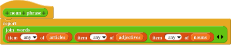

Because of the random item choices, we get a different result each time we call noun phrase

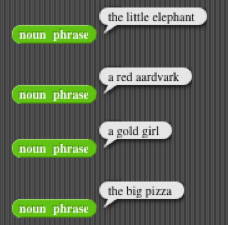

*Try this*

Create blocks prepositional phrase, verb phrase, and anything else you need, ending with a sentence block that reports sentences like "the little elephant runs excitedly around the big pizza." Can you improve on this so that the sentence structure varies, sometimes including people's names instead of article-adjective-noun phrases, for example? You might want different sentence structures for transitive and intransitive verbs. This is an open-ended project!

Besides lists of words, you'll find uses for lists of numbers, to keep track of your grades in this course, for example, or to represent a sprite's position as a single vector (list) containing the X and Y position numbers. And you can even use lists of lists for more complicated data structures

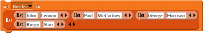

Transforming Each Item of a List
-----

In the last activity we made this list of nouns

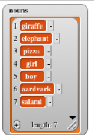

Now suppose we'd like to be able to vary our noun phrases by sometimes using one of these nouns in the plural. So we need a way to add the letter "s" to each item of the list. Find the map block near the bottom of the Variables palette and use it this way

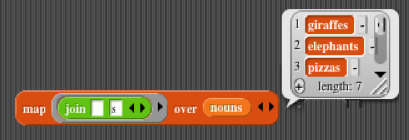

Snap! limits the size of list displays in speech balloons, so you only see the first three items of the result in this picture, but you can tell by the vertical slider and the "length: 7" that all seven elements are really in the result. If you want to see them all, drag down the bottom right corner of the list. 

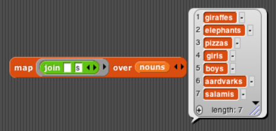 

The first input to the map block has a form you haven't seen before this

The grey ring means that the input should be a function. What we mean by this is basically the same thing as the f(x)=3x+7 kind of function in algebra, except that it doesn't have to be a numeric function. In this case the function we want is "join the letter 's' after the given word." When you drag the join block into the map input slot, the grey ring is still visible, to remind you that the input is a function, not the word that you'd get from some particular joining.

Instead of using a variable, like the x in f(x), to represent the input to the function, we leave one of join's input slots as an empty box. This is supposed to remind you of the notation 3×☐+7 ("three times box plus seven") that you learned for functions in elementary school before you knew about variables.

Try this: Modify your noun phrase block so that half the time it uses a plural noun. Note that, if you use a plural noun, the article has to be "the," rather than "a."

Here are some more examples of using map to compute some function of every item of a list:

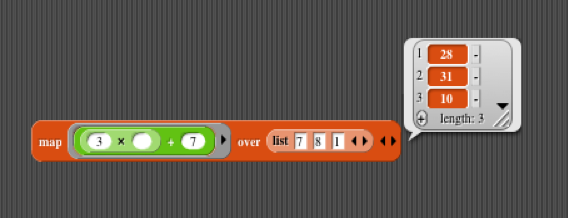

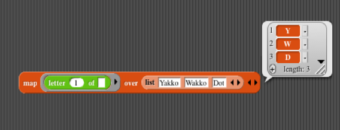

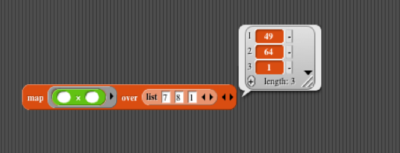

In that third example, there are two empty boxes in the function, so it's ☐×☐, which squares each number.

*Try this*
In the last activity we made a list of Beatles

Use map and this list to get a list of just the first names of the Beatles.

--------
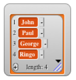

A function that, like map, takes another function as an input is called a higher order function. In the next two activities you'll meet two more higher order functions.

Choosing Some Items From a List
--------

You've probably played Geography, the game in which one player says a place name and the next player has to name another place whose first letter is the last letter of the previous place- Newark, Kentucky, Yonkers, San Francisco, Oklahoma. Have you ever gotten stuck on the letter "A"? Oklahoma, Alabama, Asia, Alaska, America, Alameda... and so on, forever.

How many states start and end with the same letter? To find out, we first need a list of all the states

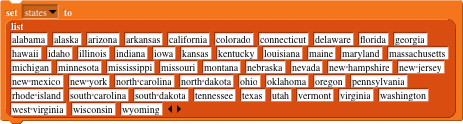

Now we want to select a subset of the states, namely the ones whose first and last letters are the same. Here's the block we use for that

Like map, the keep block has a function as its first input. Notice, though, that this grey ring's inner boundary is hexagonal. This lets you know that you should use a predicate function, which means a function that reports true or false.

We want to know whether two things are equal

The first letter of a word is letter number 1

(Note that we've deleted the word "world" that Snap! provides as a default value, a hint about what kind of input is expected. The input slot must be empty for our function-input notation to work.)

Finding the last letter is a little trickier; you find the length of the text and use that number to select which letter you want

Putting all these pieces together will give us the answer we want

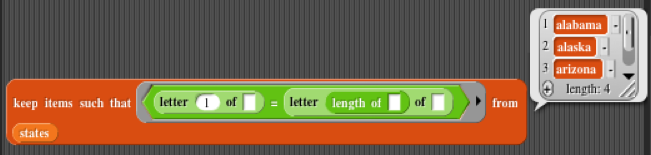

You can see from the "length: 4" in the result that there are four such states. The one you can't see in this picture is Ohio.

But if you're playing Geography, the question you really want answered is "Which states start with such-and-such a letter?" You can define a block that takes a letter as input and gives the answer to that question

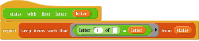

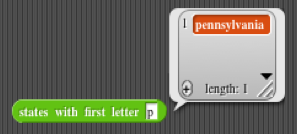

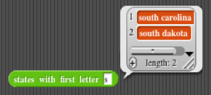

*Try this*

Write an expression that will select all the words of at least five letters from a list. For example, if the words in the list are being, for, the, benefit, of, mister, and kite, then your block should choose the words being, benefit, and mister.

Write an expression that takes a list of mixed words and numbers, and selects just the numbers, (Hint: Look for is in the Operators palette.)

Write an expression that selects from a list of words the ones that start with a vowel. (Hint: Use contains in the Variables palette.)

Combining All the Items of a List
------
Let's say you have a list of numbers, such as all the students' grades on a quiz. You want to find the average grade. There are two steps: First, add up all the numbers; then divide that sum by the number of numbers — that is, by the length of the list.

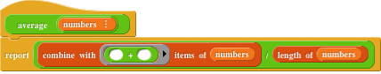

Notice that the red length of block that finds the number of items in a list is different from the green length of block that finds the number of letters in a text string. 

The first input to the combine with block is a two-input function. In this case, it's the + block, because we want to add all the numbers. In fact, unlike the situation with the map and keep blocks, there are really only a handful of functions you'll ever use with combine

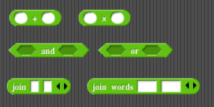

Why did we include the addition and multiplication operators, but not subtraction or division? Using an operator with combine makes sense only if it doesn't matter whether the values are combined left to right or right to left. That is, 
3+(4+5) = (3+4)+5 
but 
3-(4-5) ≠ (3-4)-5

Very occasionally you'll define a two-input custom reporter for use with combine. The two-input max block is an example; try using that to find the largest of a list of numbers.

We should try out the average block

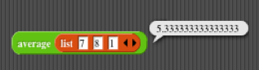

Is that the answer you'd expect?

When you Really Have to Loop
----
Consider the following problem-

Write a predicate increasing? that takes a list of numbers as input, and outputs true if the numbers are in increasing order (equal neighbors are okay), or false otherwise.

Because this is a predicate, it's tempting to try to make it use keep

But map, keep, and combine work when each item in a list can be considered independently of the others. In this problem we have to consider each item in relation to the ones that have come before it: "Is this number at least as big as the ones we've already seen?"

To do this, we need to write a loop. The loop needs to go through the lists items, from left to right, and keep track of the last item that it saw. But, as with map, we don't need to keep track of the specific number of where we are in the list (e.g., the third position, the first position, etc.) Those index numbers have nothing to do with the problem we're trying to solve. The solution is to use the for each item block, this way

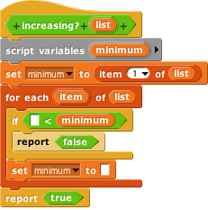

Like the functions used as input to map and friends, the script inside the C-shaped slot of for each item interprets empty input slots (in the < and set blocks) as placeholders into which an item of the list will be entered. For each item promises to go through the list starting with item 1 and continuing in sequence to the end of the list. We use a script variable minimum to remember the most recent item's value, which is the minimum allowable value for the next item. If any item is smaller than that remembered value, increasing? reports false. If we make it to the end of the list without violating that requirement, then increasing? reports true.

Note that the for each item block has the word "item" in a round orange block. It's a variable, and you can drag it into the script that goes inside the C-slot, instead of using an empty input to represent the list item

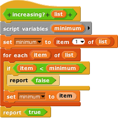
You can work with the above script here.

*Try these*
 * Display a longish list using time instead of space on the screen by saying each item for two seconds.
 * Write an expand reporter that takes a sentence as input, and reports a sentence that's the same except that each number in the input is replaced by that many copies of the following word
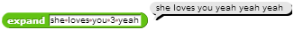
