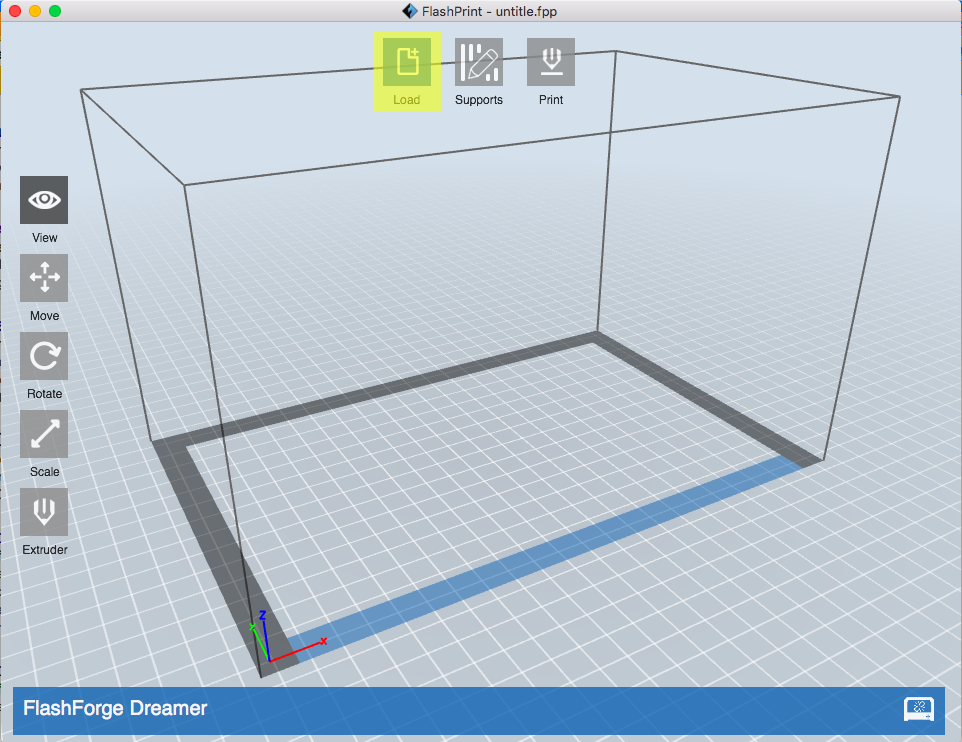

Introduction to 3D-Models
========
Learning Goals
------
  * List some of the limitations of 3D printing
  * Name some benefits and uses for 3D printing
  * When given a block of code, describe what the block is trying to do.

Start Lab
------
In order to print an object in 3D, we first need to create a model of what we want to print. For this, we are going to use [BeetleBlocks](http://beetleblocks.com/run/).

This is a program much like Snap! that you used in labs one and two. 

When Beetleblocks opens, it will start with a tutorial. Go through tutorial 1, but dont do tutorial 2!

If tutorial 1 doesn't automatically open, click the drop down on the top left and select "Open" from the list.

Now, click "Examples" from the left side of the "Open Project" box and select "Tutorial 1" from the list.

By the end of Tutorial 1, you should have an object that looks like this:

Modifying your tutorial 3D model!
------

Let's make your model more interesting by adding some more spheres and some colour (note: we won't be printing those colours).

Our repeat loop is currently running 10 times and rotating in the z-axis by 36 degrees. Let's change the loop to make it repeat 36 times and set the z-axis roation to 10.

Congratulations! You now have a connected ring of spheres, but let's make it stronger and prettier. 

To make a stronger structure, we want to have the spheres overlap. You can achieve this by editing the move block value from 0.5 to be 0.3.

To change colour, use the Color menu on the top left. Place the "change hue by" block anywhere into your repeat block.

You should now have an object that looks like this:

Don't forget to save what you have so you can always come back to it!

Make your own 3D Model to print!
------
By now, you have a feel for what you can do in BeetleBlocks, so it's time to make your own object to 3D print.

Feel free to modify your tutorial or explore some example projects and modify something that you like! 

While you can spend all day playing with BeetleBlocks, make sure you leave 20 minutes in order to make your model print ready!

Let's 3D Print!
------

Once you are ready to print your object, we need to download it as an STL file and get it ready to be printed.

From the drop down Select "Download 3D model as..." and select STL.

Open FlashPrint and click the "Load" button. Navigate to your .stl file tht you downloaded. 

Once you open the .stl file, a dialogue box will ask you if you want to put it on the platform. Click "Yes".

If you cannot see your object, don't panic! The object may be too small to see. You can fix this by clicking on your object, and then clicking on the "Scale" button (located on the left side) twice until a menu opens.

You can make object larger by increasing the dimension of any of the axes. As long as the "Uniform Scaling" box is checked, you can safely increase any of the axes without distorting your model.

Change any of the X,Y, or Z dimensions to around 20mm. You should not be able to see your object!

Note: Keep in mind that we are less inclined to print anything that is too large and will take hours to print, so if you scale something too large, the TA may re-scale it down.

When 3D printing, we wabt our object to lay flat so let's rotate our object.

Click your object and then click "Rotate" twice so the menu comes up. Use the +90 degrees button to rotate it downwards.

Now that your object is flat, let's place it on the printing bed.

With your object selected, click "Move" and then click the "On Platform" button.

Optional: if you have too many overhangs, add supports.

Sometimes, we build objects that have spaces between them or portions that overhang. However, when we 3D print, we need a stable platform to build on. To address this, we try to avoid overhangs and empty spaces, but failing that, you can always add supports.

If you need supports, click the "Supports" button.

Then, select "Support Options" and pick "Treelike".

Now, click "Auto Supports" to fill them in, and then hit the "Back" button.

Let's Print!

Hit the Print button at the top of the screen.

Make sure the following settings are set this way unless your TA says otherwise:
Machine Type: FlashForge Dreamer
Material Right: PLA
Material Left: PLA

Resolution: Standard

Under More Options -> Temperature
Right Extruder: 200
Platform: 50

Now, send your newly created .g file and your .stl file to your TA via email and they will start printing it!
