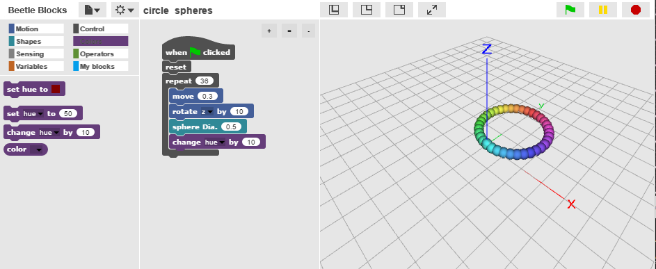
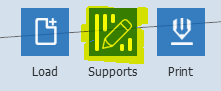

Introduction to 3D-Models
========

In order to Print out an object in 3D we first need to create a model of the object we want to print. For this we are going to use [BeetleBlocks](http://beetleblocks.com/run/).

This is a program much like Snap! that you used in Lab's one and two. 

When beetleblocks opens it will start with a tutorial, run through tutorial 1, but dont do tutorial 2!

If tutorial 1 doesn't automatically open click the drop down on the top left and select Open from the list

Now click Examples from the left side of the Open Project box and select Tutorial 1 from the list.

By then end of Tutorial 1 you should have an object that looks like this:

Modifying your tutorial 3D model!
------

Let's make your model more interesting by adding some more spheres and some colour (Note: we won't be printing those colours).

Our repeat loop is currently running 10 times and rotating in the z-axis by 36 degrees.Let's change that to repeat 36 times and set the z-axis roation to 10.

Congratulations, you now have a connected ring of spheres, but let's make it stronger and prettier. 

Edit the move block value from 0.5 to be 0.3 to have your spheres will overlap making a stronger structure.

Let's also add some color.
From the Color menu on the top left drag over the "change hue by " block and place it anywhere into your repat block.

You should now have an object that looks like this:

Don't forget to save what you have so you can always come back to it!

Make your own 3D Model to print!
------
By now you have a feel for what you can do in BeetleBlocks, so it's time to make your own object to 3D print.

Feel free to modify your tutorial or explore some example projects and modify something that you like! 

While you can spend all day playing with BeetleBlocks, make sure you leave 20 minutes in order to make your model print ready!

Let's 3D Print!
------

Once you are ready to print your object we need to download it as an STL file and get it ready to be printed.

From the drop down Select "Download 3D model as..." and select STL.

Now that you have your file, open FlashPrint and click the Load button then navigate to your .stl file tht you downloaded. 

Once you open it dialogue box will probably ask you if you want to put it on the platform, click yes.

Dont Panic, but you may not be able to see your object as it's too small! Let's scale it!
Click your object, then click on the scale button on the left twice until a menu opens.

Let's make our object larger by increasing the dimension of any of the axis, as long as the Uniform Scaling box it's checked you can safely increase anyone.

Increase any of the X,Y, or Z dimensions to around 20mm. You should not be able to see your object!

Note: Keep in mind that we are less inclined to print anything that is too large and will take hours to print, so if you scale something too large the TA may re-scale it down.

When 3D printing we would want our object to lay flat so lets rotate our object.

Click your object then clik "Rotate" twice so the menu comes up. Use the +90 degrees button to rotate it down.

Now that your object is flat let's place it on the printing bed.

With your object selected click Move and click the "On Platform" button.

Optional: if you have too many overhangs add Supports

Some times we build objects that have spaces between them or overhangs, when we 3D print however we need a stable platform to build on. To address this we try to avoid overhangs and empty space, but failing that you can always add supports.

If you need supports click the Supports button

Then select Support Options and pick Treelike.

Now click Auto Supports to fill them in, then hit the back button.

Let's Print!

Hit the Print button at the top of the screen.

Make sure the following settings are set this way unless your TA says otherwise:
Machine Type: FlashForge Dreamer
Material Right: PLA
Material Left: PLA

Resolution: Standard

Under More Options -> Temperature
Right Extruder: 200
Platform: 50

Now just send your newly created .g file and your .stl file to your TA via email and they will start printing it!
