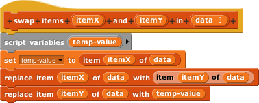
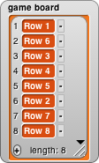
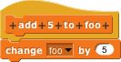
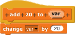
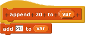
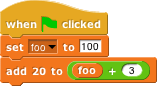

Swap Two List Values
----

We want to make a block that swaps two items in a list. The block takes two numbers, representing positions of 
items in the list, and the list itself as its inputs; it swaps the positions of those items in the list. Make 
this block in the List category; it's a command block. Set the input types of itemX and itemY to number, and the 
type of data to list. 

When you click Apply, you should be able to see the block with two round number input spots and one list input spot.

(By the way, we called the list input data instead of list because people have commented that it's too easy to 
confuse a list variable block with the block to create an empty list  
Finish entering the complete script

Here is an example of how the block will be used: If we run the block with the arguments 

where game board is the list

then the list should become

The replace item blocks in this script are an example of a new technique, list mutation--changing items in an 
existing list, instead of creating a new list the way map and keep do. As in this example, mutation can be more
efficient than recopying the entire list except for the two changed items. On the other hand, mutation introduces 
the possibility of new kinds of bugs that can't happen with functional programming, the technique we've been using 
with lists until now. If two parts of a large program are using the same list for different purposes, and one part
mutates the list, the other part will get confused. That's why we showed you functional programming first, and why 
functional programming should be your first instinct.

We have used mutation before with non-list data; for example, the for block changes the value of its variable i 
each time through the loop. Mutation isn't so dangerous in that context, because that variable exists only inside 
the for loop, there's no way another part of the program can be relying on an old value. Mutating global variables 
does have the same risk, though, which is why we've been saying that script variables are a better choice when 
possible. But a game board is an example of a value that's unavoidably both global and mutable.

Mutation of Variables
----
Suppose I have a global variable named foo , and I define the following two blocks

 

Now I run the following script:

Will the final value of foo be 100? 105? 120? or 125? Try it and see.

Now do the following similar experiment, but with a list as the value of foo

     

What items will be in foo after running this script?

Why do these two experiments give different results?

It's not surprising that the two blocks that specifically change the global variable foo succeed. 
But how come you can add a new item to a list passed into a block as input, whereas you can't change a 
numeric variable passed in as input?

Snap! is actually behaving consistently in these two cases. To understand why, you have to keep clear in your
mind the difference between a value–a number, text string, Boolean (true/false), or list–and a variable, which 
is essentially a connection between a name and a value. (This is not precisely the definition of "variable" you'd 
learn in a programming language design course, but it's close enough until you have to implement a programming 
language yourself.)

As in most programming languages, the inputs you provide to a block in a Snap! program are values. The block 
doesn't know how the value was provided: typed directly into an input slot, computed by a reporter dragged into 
the slot, or taken from a variable dragged into the slot.

If that went over your head because it's too abstract, consider this script

You wouldn't expect that to change the value of foo to— To what? 123? 117? It just doesn't make sense to expect 
this to change foo at all. The input to the add 20 to block is the number 103–the value of foo+3–not the variable. 
The same is true in the original experiment; the input to add 20 to is the number 105 (because the add 5 to foo 
block specifically changed foo ), not the variable foo itself.

The change block in the definition of add 20 to does change a variable: the variable it says it changes, namely 
var . That variable is local to the block's defining script, so changing it doesn't affect the rest of the program
at all. Local variables are temporary; when the block finishes, the variable is gone.

What if the value of foo is a list? Unlike numbers, lists themselves are mutable. (Variables are mutable, too, 
which is why we're having this discussion, but only when the variable name itself appears in a set or change
block.) After the two append blocks in the second experiment are run, the value associated with variable foo 
is the same list as it was before. But that list now has more elements. We say that it "maintains its identity"
even though its contents have changed.

