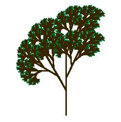
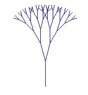
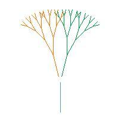
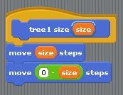
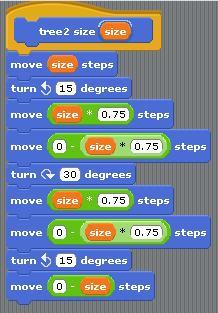
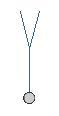
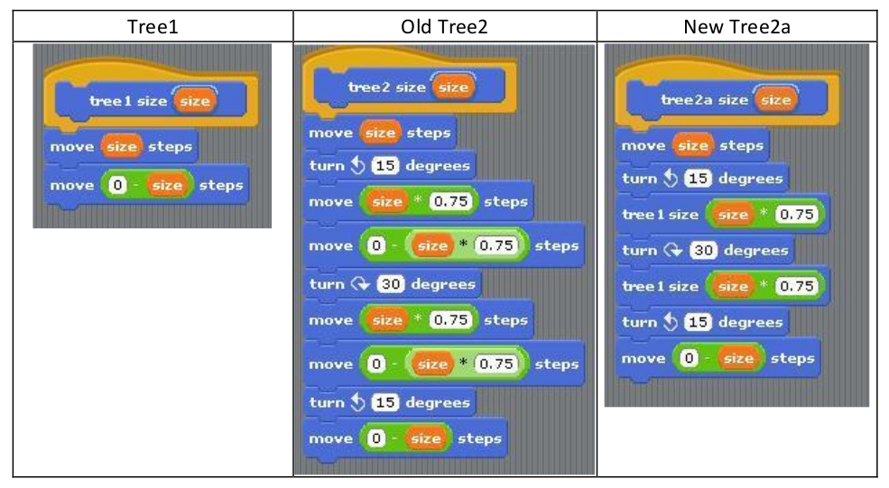
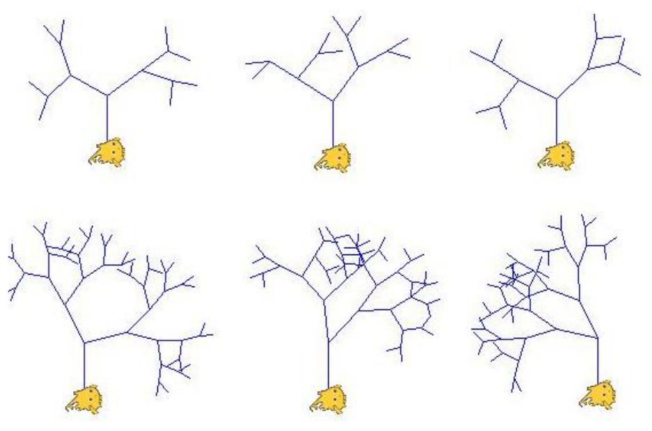
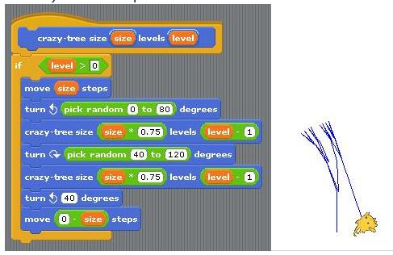
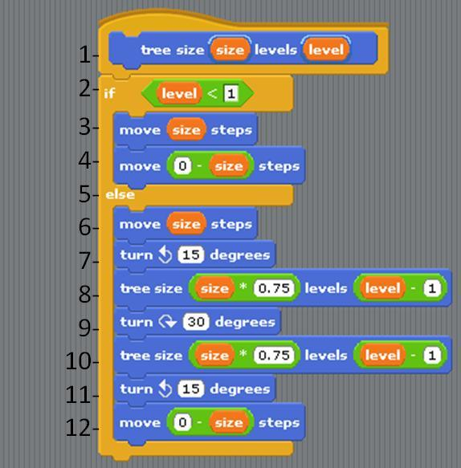

Make a Recursive Tree
=====================
This assignment must be done using the BYOB (Build Your Own Blocks) version of BYOB/SNAP.
When you make blocks, **be sure that the ATOMIC box is not checked**! (This will allow you to
stop your program if you write a program that will go on forever!)

Our goal is to draw a tree like this:

but we'll start with a simpler version that shows the technique clearly, although less prettily:

The key to understanding this technique is to see that the tree is a fractal, that is, a picture that
contains smaller versions of itself:

We're going to create a TREE block in BYOB BYOB/SNAP. It'll start with a MOVE block to draw
the trunk of the tree, then a TURN block turning left, then a TREE block to draw the left smaller
tree, and so on.

"Wait!" you're probably thinking. "How can we use a TREE block inside a TREE block? It doesn't
exist yet!" That's the big idea for this assignment.

We're going to work up to the complicated tree starting with very simple steps.

Step 1. Make a TREE1 block (so named because it draws just one level of the tree) using this script:

This looks ridiculously simple, but trust us, it'll get interesting soon. When run, the script draws
one tree branch, and then *moves the sprite back to its original position*. That's going to be really
important when we start using scripts within scripts; we always want to be able to assume that
our tree blocks leave the sprite in the same position, and facing the same direction, after it as
before it.

Step 2. Point the sprite facing upward, and put the pen down. Then try TREE1 SIZE 50. You should
get a result something like this:

Step 3. Make a TREE2 block that draws two levels:

When run, it should give this result:

 * At this rate we'll never be able to make the beautiful version of the tree. In the next
   step, we'll discuss how to simplify this process.
 * Before going on, make sure that you can mentally trace through the code provided.
   Paying close attention to the forwards and turns is going to be important to see the big
   picture and understand the recursion.

Step 4. That TREE2 block is pretty long and repetitive. But we can simplify it if we notice that in
two places it has a move forward/move back pair of blocks, and that this is what TREE1
does! So we can use TREE1 to shorten TREE2. Compare the code below to convince yourself
that the new Tree2a will work the same as the original Tree2.

Note that the tree blocks inside this TREE2A script are TREE1 blocks, not TREE2 blocks! So
there's no mysterious TREE-using-TREE situation here; it's not unusual for one block to be
used in another block's script.

Step 5. Make a TREE3 block that uses the TREE2 block, on the same pattern, and see if you get
the result that you expect.

Step 6. If you can stand it, make a TREE4 block that uses the TREE3 block and try it out.

**This would be a good time to save your project.**

Step 7. Okay, here's the big idea: We can write a TREE block that uses itself in its own script
*provided that it knows how many levels it's expected to draw*! So, in addition to the size
input, it'll have a LEVELS input:

In the earlier steps, TREE3 used TREE2; TREE2 used TREE1. Here, TREE will use TREE, but
reducing the number of levels by 1.

Step 8. Once you can draw a tree of five or six levels using your TREE block, see if you can make
one like the first picture in this handout. It's different from what we've done so far because
the smaller trees are drawn part way up the trunk, instead of at the top of the trunk, and
because the pen color is green for the lowest-level branches (the TREE1-like ones) and
brown for the others. You don't have to get it exactly like the picture; just try to make a
more realistic-looking tree.

Vary Your Tree
--------------
Change your tree in the following ways. You should probably try these one at a time so that you
can always tell which change you made caused a new bug.

 * change the turn angle
 * change the scale factor
 * change the number of recursive calls
 
Note: If your character goes off the screen your image might get messed up because you'll tell
your character to change their y-position but the character literally won't be able to.

Random Tree
-----------
We want to make a tree that looks more random. Here are some pictures of different runs of
the program with different levels so that you can see what we were thinking.

Unfortunately our attempt (shown below) was unsuccessful (see "tree" on the right). Modify
the crazy-tree code to produce the random trees as shown above.

Base Cases
----------
Now that you have some experience with some recursion, we're going to point out some of the
anatomy of a recursive procedure.

We always need a way to figure out that we're done and shouldn't call the recursive call
again. Lines 2-4 are the "Base Case" where we handle things that are SO simple we don't
need to call the recursive case again.

If this isn't the base case we think to ourselves "Woah - That seems complicated. I'll just
do a small part of the problem and delegate to someone else". Here's what we do:
 * draw the trunk of the tree (line 6),
 * position the character for the left sub-tree (line 7),
 * delegate to another copy of the tree block to draw the left sub-tree (line 8),
 * re-position the character for the right sub-tree (line 9),
 * delegate to another copy of the tree block to draw the right sub-tree (line 10),
 * re-position the character to retrace the trunk (line 11), and
 * re-trace the trunk and leave the character exactly where it started out.

This wasn't the "best" one we discussed in a previous step, but is a good example of a base
case. (Note here we addressed the problem of getting infinite recursion when we have a level
less than 0.

