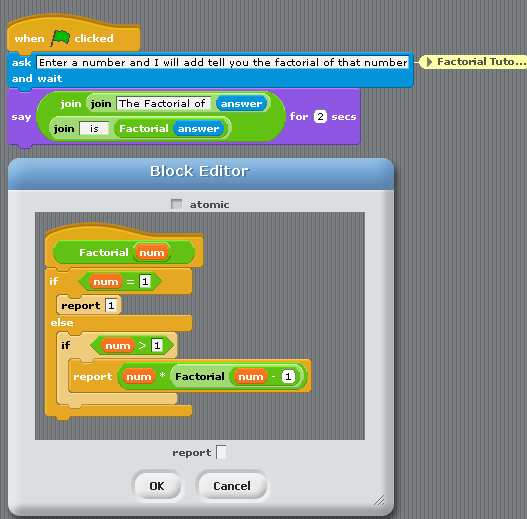
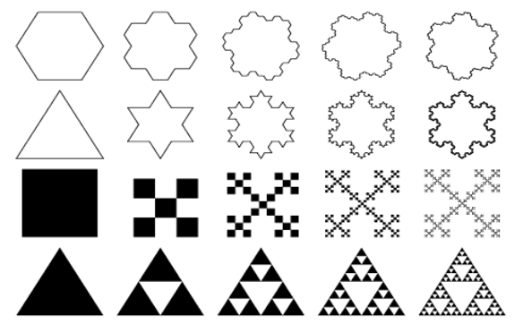
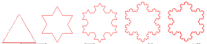
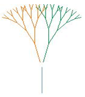
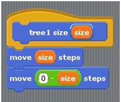
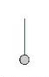
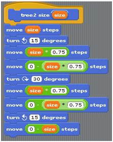
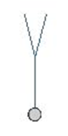
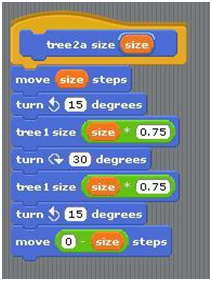
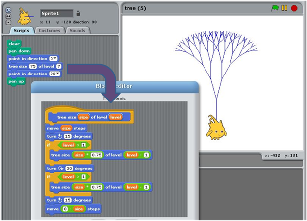

What is Recursion?
==================
This activity addresses the concept of **recursion**. It provides an illustration of how recursion is used in computing.

Introduction
------------

What is recursion? A recursive process is one in which objects are defined in terms of other objects of the same type (Wolfram MathWorld). So what does that mean??? It is a function (procedure) that calls itself! When performing recursion, we try to reduce a large problem into a series of similar, smaller problems that can be solved in a similar ways. In fact, it is often best if we can reduce the large problem into a collection of trivially small problems.

The best way to understand is to look at an example. Factorials are an excellent example.

5! (factorial) is 5 * 4 * 3 * 2 * 1 = 120, right?

So basically…

5!

is the same as

5 * 4!

Which is the same as

5 * 4 * 3!,

Which is the same as

5 * 4 * 3 * 2!

Which is the same as

5 * 4 * 3 * 2 * 1!

1! is just 1.

Let’s look at it in another way: n! is n * (n – 1)! This is what we just demonstrated. If I create a procedure called Factorial that will get the answer of the factorial of the number I send over to the procedure, then I could create a recursive function like this…

Factorial(n) = n * Factorial(n -1)

The Factorial(n – 1) would keep executing until it reached a stopping point, in this case 1 as that is the last number I will need to multiple. So I am using my procedure to “call” itself, sending over a simpler version (in this case a smaller number) until I get to the smallest number (in this case the number 1). This smallest number is what is called the Base Case – when the function should stop calling itself.

Factorial (5)

5 * Factorial(4)

5 * 4 * Factorial(3)

5 * 4 * 3 * Factorial(2)

5 * 4 * 3 * 2 * Factorial(1)

which rolls out like this...

5 * 4 * 3 * 2 * 1

5 * 4 * 3 * 2

5 * 4 * 6

5 * 24

120

Factorial Recursion in BYOB
---------------------------

Visual Recursion
----------------
Let’s look at visual recursion where we have a recursive call that is going to draw something, in our case fractals.

What are Fractals?
------------------
They're everywhere, those bright, weird, beautiful shapes called fractals. But what are they?

Fractals are geometric figures, just like rectangles, circles and squares, but fractals have special properties that those figures do not have. Using your computer, find an image of a fractal. You may see some of the following images.

The Koch Snowflake
------------------
The Koch Snowflake is a famous fractal. How is it made? It starts with an equilateral triangle. Divide one side of the triangle into three equal parts and remove the middle section. Replace it with two lines the same length as the section you removed. Do this to all three sides of the triangle. Keep repeating steps 1, 2 and 3 infinitely and you get the fractal, the Koch Snowflake. 

Let’s look at another example of recursion.

Recursion to Draw a Tree
------------------------
This is a simple tree where we want to draw the base (the line for the trunk), then
the branches. Note that I am drawing smaller and smaller versions of the same lines. This is perfect for recursion!

Let’s start with drawing the base. This is our “trunk” of the tree.

 

In BYOB, we will tell byob to move “size” steps, then move back. Next, we will need to draw
the first branches. Move the steps (back up to the top); then turn and move (75%) and then move (75%) back. Turn back to center + amount to other side; then move (75%) and
move (75%) back. This way we get the smaller branches.

 

We can now use our code from drawing the first tree to help us draw the next level.

We can use variables to make the drawing relative to previous settings. This is one example of the finished code.

*Material from UC Berkeley*

