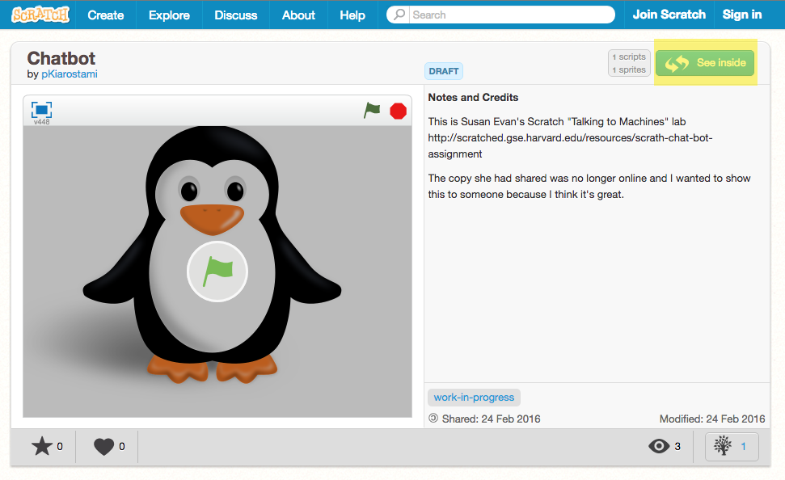
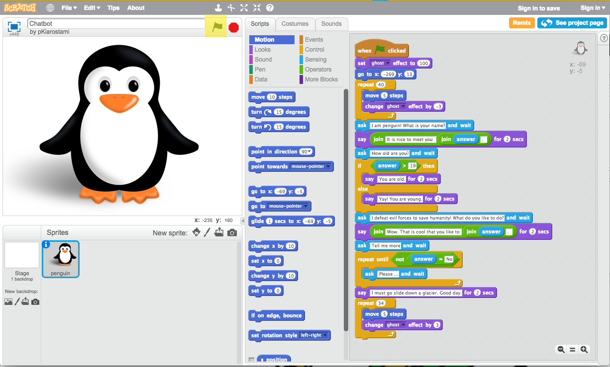

Lab 13 - AI
================================
Learning Goals: 
------------------------
  * Understand how Cleverbot and Eliza differ from each other
  * Describe how AI replies can be crafted using patterns
  * Understand the limitations of AI

Talk to Eliza: 
------------------------
Open a web browser and go to this [Eliza Chat bot](http://nlp-addiction.com/eliza/)

Address Eliza in the second person. Ask her questions about herself.  (For example, ask how she is, how much she charges, etc.).  What happens?

Try the following:

1. Complain about something in your life.  How does Eliza react?
2. Tell Eliza about your family.
3. Type in nonsense of some sort. How does Eliza respond?
4. Use your imagination! This is a "wildcard" question - type in anything you want and note the response as before. Feel free to continue the conversation you start as you would with a person.

Try Cleverbot: A Modern Eliza
----------------------------

Open a web browser and go to [Cleverbot](http://www.cleverbot.com/)

Try repeating steps 1-4 from before:

1. Complain about something in your life.  How does Cleverbot react?
2. Tell Eliza about your family.
3. Type in nonsense of some sort. How does Cleverbot respond?
4. Use your imagination! This is a "wildcard" question - type in anything you want and note the response as before. Feel free to continue the conversation you start as you would with a person.

How does this differ from talking to Eliza? What observations can you make about how CleverBot works?

Lab Discussion: Can computers be taught to think?
-------------------------------
With your lab partner or in groups, discuss the following:

What patterns did you see in how Eliza/Cleverbot respond?
Which bot did you like talking to more? Why?
When did it seem like you were talking to a human? 
When did it seem like you were not talking to a human?

Try a Chatbot in Scratch:
-------------------------------

Open a web browser and go to [Scratch chatbot](https://scratch.mit.edu/projects/99107504/)

Click the green "See inside" button in the top right corner.

To start the program, click the green "Start" flag at the top and go through the program.

On the right hand side of the screen, you can see all the code that made the program interact with you.
Trace through and see if you can understand how it tried to guess your answer to the question "Tell me more"

